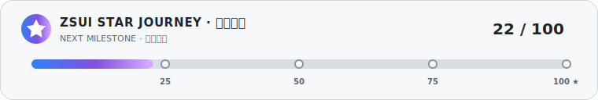
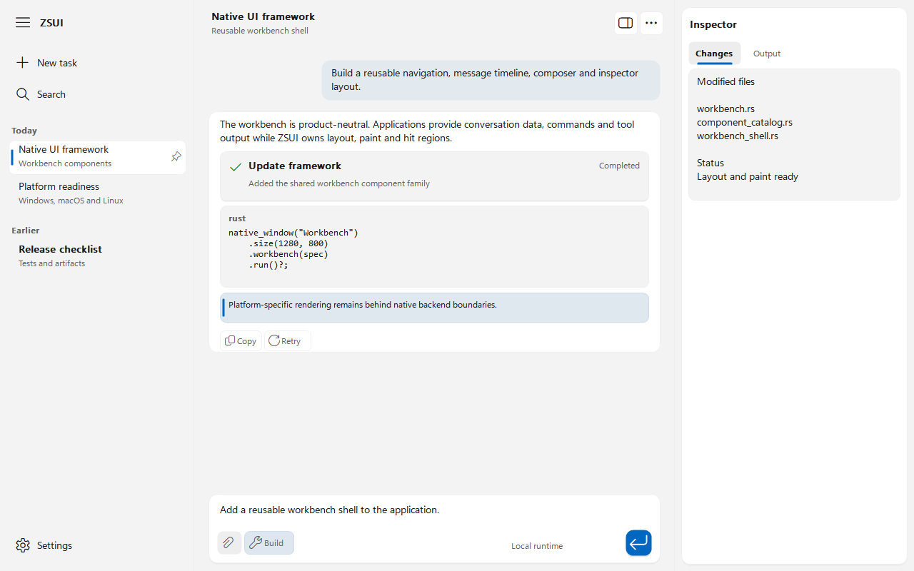

<div align="center">

# ZSUI

**A lightweight, Rust-first native UI framework**

Compose with traits, route typed messages, and compile only the controls,
services, and platform backends an application enables.

[](https://github.com/qiu7824/zsui/actions/workflows/ci.yml)

[](LICENSE)


<a href="README.md">简体中文</a>
&nbsp;&nbsp;·&nbsp;&nbsp;
<a href="README.en.md"><strong>English</strong></a>

<a href="https://github.com/qiu7824/zsui/stargazers">
  
</a>

</div>

ZSUI is a Rust-first native system UI framework.
It is intentionally declaration-first: application code describes windows,
tray/status menus, commands, hotkeys, settings pages and host capabilities in
Rust, while each platform host translates those declarations to Win32, AppKit,
GTK4 or mobile hosts.

ZSUI is not a browser shell. Product behavior stays in the product crate;
ZSUI owns a feature-gated self-drawn widget tree, typed state and messages,
layout, semantic themes, rendering, input routing and native services.
Windows uses the Win32/GDI path with a buffered no-flicker paint pipeline:
`WM_ERASEBKGND` is suppressed and paint goes through a buffered top-down DIB
when available. macOS and Linux have real first-pass AppKit and GTK4
host/render/input paths; target-machine proof is still incomplete and is not
substituted by the optional winit fallback.

<p align="center">
  
</p>

<table>
  <tr>
    <td width="68%"></td>
    <td width="32%"></td>
  </tr>
  <tr>
    <td align="center">Modern document shell with a native text service</td>
    <td align="center">Modern standard calculator</td>
  </tr>
</table>

<p align="center"><a href="docs/gallery.md"><b>Open the full demo and comparison gallery</b></a></p>

<details>
<summary><b>Show ZSUI / egui / Iced / Slint / Tauri 2 / Windows comparisons</b></summary>

<h4>Notepad</h4>
<table>
  <tr><th>ZSUI</th><th>Iced</th><th>Slint</th></tr>
  <tr>
    <td></td>
    <td></td>
    <td></td>
  </tr>
</table>
<table>
  <tr><th>eframe / egui</th><th>Tauri 2</th><th>Windows Notepad</th></tr>
  <tr>
    <td></td>
    <td></td>
    <td></td>
  </tr>
</table>

<h4>Calculator</h4>
<table>
  <tr><th>ZSUI</th><th>Windows Calculator</th></tr>
  <tr>
    <td></td>
    <td></td>
  </tr>
</table>

</details>

## Quick Start

```rust
use zsui::{app, Command, MemoryHost, TraySpec, Window};

let mut host = MemoryHost::new();
let runtime = app("Example")
    .window(Window::new("Example").size(900, 620))
    .tray(
        TraySpec::new()
            .tooltip("Example")
            .item("Open", Command::ShowMainWindow)
            .separator()
            .item("Quit", Command::Quit),
    )
    .global_hotkey("Alt+V", Command::OpenQuickPanel)
    .run_with_host(&mut host)?;
# Ok::<(), zsui::ZsuiError>(())
```

Create a real native OS window with one entry point:

```rust,no_run
#![cfg_attr(all(windows, not(debug_assertions)), windows_subsystem = "windows")]

fn main() -> zsui::ZsuiResult<()> {
    zsui::native_window("Example").size(900, 620).run()?;
    Ok(())
}
```

The final application crate selects the Windows PE subsystem. User-facing
release binaries should retain the crate attribute above so launching them does
not create a console window. Debug builds keep their console for diagnostics.
ZSUI's GUI examples and release artifacts enforce this boundary with
`scripts/check-windows-gui-subsystem.ps1`.

Input controls use the same strongly typed message path. For example, a Slider
can constrain its value to an explicit range and step:

```rust,no_run
use zsui::{slider, SliderRange, ViewNode};

#[derive(Clone)]
enum Msg {
    VolumeChanged(f32),
}

fn volume_control(value: f32) -> ViewNode<Msg> {
    slider(value, SliderRange::new(0.0, 100.0).step(5.0))
        .on_slide(Msg::VolumeChanged)
}
```

RadioButton grouping stays in explicit application state rather than a global
control registry:

```rust,no_run
use zsui::{radio_button, ViewNode};

#[derive(Clone, Copy, PartialEq)]
enum Mode { Balanced, Performance }

#[derive(Clone)]
enum ModeMsg { Choose(Mode) }

fn mode_option(mode: Mode, current: Mode) -> ViewNode<ModeMsg> {
    let label = match mode { Mode::Balanced => "Balanced", Mode::Performance => "Performance" };
    radio_button(label, current == mode).on_choose(ModeMsg::Choose(mode))
}
```

Determinate progress uses its own range and does not require the Slider
feature:

```rust,no_run
use zsui::{progress_bar, ProgressRange, ViewNode};

fn download_progress(percent: f32) -> ViewNode<()> {
    progress_bar(percent, ProgressRange::new(0.0, 100.0))
}
```

Circular waiting feedback uses the independent `progress-ring` feature and does
not pull in ProgressBar:

```rust,no_run
use zsui::{progress_ring, ViewNode, ZsProgressRingSpec};

fn connecting() -> ViewNode<()> {
    progress_ring(ZsProgressRingSpec::indeterminate())
}
```

ComboBox selection and expansion also stay in explicit application state, and
overlay options return strongly typed messages:

```rust,no_run
use zsui::{combo_box, ViewNode};

#[derive(Clone)]
enum Msg { Selected(usize), Expanded(bool) }

fn mode_picker(selected: Option<usize>, expanded: bool) -> ViewNode<Msg> {
    combo_box(["Balanced", "Performance", "Quiet"], selected)
        .expanded(expanded)
        .on_select(Msg::Selected)
        .on_expanded_change(Msg::Expanded)
}
```

Tabs use `ZsTabId` instead of label strings as identity, and only the selected
page participates in layout, paint, hit testing and event dispatch. Platform
keyboard conventions stay inside the backend, so application code needs no
platform `cfg`:

```rust,no_run
use zsui::{tab_view, text, ViewNode, WidgetId, ZsTabId, ZsTabItem};

#[derive(Clone)]
enum Msg { SelectTab(ZsTabId) }

fn pages(selected: ZsTabId) -> ViewNode<Msg> {
    tab_view([
        ZsTabItem::new(ZsTabId::new(1), "General", text("General settings")),
        ZsTabItem::new(ZsTabId::new(2), "Advanced", text("Advanced settings")),
    ], Some(selected))
        .id(WidgetId::new(10))
        .on_tab_select(Msg::SelectTab)
}
```

Attach a typed Rust view to the same native window path:

```rust,no_run
use zsui::{button, column, native_window, text, WidgetId};

#[derive(Clone)]
enum Msg {
    Save,
}

native_window("Example")
    .size(900, 620)
    .view(column(vec![
        text::<Msg>("Settings"),
        button("Save").id(WidgetId::new(1)).on_click(Msg::Save),
    ]))
    .run()?;
# Ok::<(), zsui::ZsuiError>(())
```

For an application-owned state loop, use `stateful_view`. Every native input is
converted to `Msg`, passed through `update`, then the view is rebuilt and the
window is repainted:

```rust,no_run
use zsui::{
    button, column, native_window, text, AppCx, Command, NativeWindowRuntimeDriver,
    ViewNode, WidgetId,
};

struct State { count: u32 }
#[derive(Clone)]
enum Msg { Increment }

fn view(state: &State) -> ViewNode<Msg> {
    column([
        text(format!("Count: {}", state.count)),
        button("Increment").id(WidgetId::new(1)).on_click(Msg::Increment),
    ])
}

fn update(state: &mut State, msg: Msg, cx: &mut AppCx) {
    match msg {
        Msg::Increment => {
            state.count += 1;
            cx.command(Command::custom("counter.incremented"));
        }
    }
}

native_window("Counter")
    .stateful_view(State { count: 0 }, view, update)
    .app_command_executor(NativeWindowRuntimeDriver::new())
    .run()?;
# Ok::<(), zsui::ZsuiError>(())
```

Resident monitoring applications can opt into hidden-window resource release:

```rust,no_run
# use zsui::{native_window, spacer, AppCx, ViewNode};
# #[derive(Clone)] enum Msg {}
# struct State;
# fn view(_: &State) -> ViewNode<Msg> { spacer() }
# fn update(_: &mut State, msg: Msg, _: &mut AppCx) { match msg {} }
native_window("Monitor")
    .release_view_when_hidden()
    .stateful_view(State, view, update)
    .run()?;
# Ok::<(), zsui::ZsuiError>(())
```

When the window is minimized or hidden, ZSUI drops its `View` tree, draw and
hit plans, and transient input caches. Application state, command routing, and
application-owned monitoring services remain alive; showing the window rebuilds
the view from the retained state.

For codebases that want compile-time content enforcement, use the opt-in
typestate entry point. `build`, `run` and `run_smoke` do not exist until one of
the content methods changes the builder to `NativeWindowContentReady`:

```rust,no_run
use zsui::{text, typed_native_window};

typed_native_window("Strict Window")
    .size(640, 420)
    .view(text::<()>("Ready"))
    .run()?;
# Ok::<(), zsui::ZsuiError>(())
```

When a native smoke path needs direct UI command routing, use the command-view
variant. It keeps widget input typed while emitting reusable `UiCommand`s:

```rust,no_run
use zsui::{
    button, column, native_window, text, CommandId, NativeWindowRuntimeDriver, UiCommand,
    WidgetId,
};

native_window("Example")
    .size(900, 620)
    .ui_command_view(column(vec![
        text::<UiCommand>("Settings"),
        button("Save")
            .id(WidgetId::new(1))
            .on_click(UiCommand::app(CommandId("app.save"))),
    ]))
    .ui_command_executor(NativeWindowRuntimeDriver::new())
    .run()?;
# Ok::<(), zsui::ZsuiError>(())
```

Use a small feature set when embedding ZSUI into another Rust app:

```toml
[dependencies]
zsui = { version = "0.2.0-preview.5", default-features = false, features = [
    "window",
    "button",
    "toggle",
    "slider",
    "radio",
    "progress",
    "list",
    "scroll",
    "dark-mode",
] }
```

The intended shape is Rust-style compile-on-demand: default features stay small
(`window`, `button`, `label`), heavy backend dependencies are optional, and
advanced widgets are behind explicit feature gates. This is feature/crate based
trimming, not a promise that Cargo magically removes every unused symbol inside
an enabled crate. Controls such as `password-box`, `tooltip`, `progress-ring`, `tabs` and
`date-picker` can be selected
individually; `all-widgets` and `full` are included only when an application
explicitly opts in. Native focused-text accessibility is also opt-in through
`accessibility`: it uses UI Automation on Win32, AppKit Accessibility on macOS,
and GTK4 Accessibility on Linux without embedding a platform editor or WebView.
Localization is an independent `localization` service feature. Applications own
their `ZsLocalizer`, use stable message IDs, Fluent parameters and plural rules,
Unicode locale fallback, and normal typed state updates for runtime language
changes. See the [localization guide](docs/localization.md).
The `window` feature selects Win32, AppKit or GTK4 through
target-specific dependencies, so the one-line window entry does not require an
extra backend feature on supported desktop targets. Cargo features are additive
across the dependency graph, so
large widgets and heavy native backends should move toward split crates or
feature modules such as `zsui-core`, `zsui-shell`, `zsui-render`,
`zsui-style`, `zsui-widgets-base`, `zsui-widgets-input`,
`zsui-widgets-list` and `zsui-widgets-extra`.

Long uniform-row collections use the optional `paged-list` feature. It combines
visible-range-only layout and painting with a dedicated loader thread, request
deduplication, stale-generation rejection, direction-aware queue pruning,
anchor-preserving synchronized reconciliation and a bounded LRU page cache:

```text
cargo run --example paged_virtual_list --no-default-features --features window,button,label,paged-list
```

The optional `image-preview` feature decodes PNG frames on an owned worker,
coalesces pending requests, rejects stale generations and retains the last
complete frame until the next frame is ready. Win32 draws the published raster
inside the buffered paint transaction:

```text
cargo run --example image_preview --no-default-features --features window,button,label,image-preview
```

See [`docs/image-preview.md`](docs/image-preview.md) for lifecycle and target
status details.

See [`docs/paged-virtual-list.md`](docs/paged-virtual-list.md) for the data-source
contract and verification commands.

## Rust-First Target

ZSUI's long-term API target is not a C++/C# style inheritance tree. The
framework should be built around trait surfaces, typed messages, explicit state,
RAII-owned native resources, safe public APIs, `Result<T, ZsuiError>` failures,
capability traits, feature-gated backends, theme tokens, typed units and strong
IDs. It also preserves the simple `zsui::native_window(...).run()?` entry point
for native desktop windows, treats Android and Harmony as explicit future
Activity/Ability hosts, uses buffered no-flicker native rendering as the
Windows baseline, and only adds wider platform API crates such as
`windows-rs` when a concrete backend surface needs them. The modular target is
a small facade with feature-gated crates/modules, not a monolithic always-on
control registry.
The machine-readable target list is exposed through
`zsui_rust_first_goals()` and `zsui_rust_first_goal_names()`; the longer
target narrative is in `docs/framework-goals.md`.
The first concrete layer is now in `src/view/mod.rs`, `src/app_command.rs`,
`src/style.rs` and `src/geometry.rs`: `View<Msg>`, `WidgetId`, `AppCx`,
`SharedAppCommandExecutor`, `ViewEventCx`,
`ViewPaintCx`, `ViewInteractionPlan`, `Px`, `Dp`, `Dpi`, `ZsuiTheme` and
tokenized color/radius/spacing primitives.
For the WinUI-style self-drawn surface, `src/shell_layout.rs` now provides a
product-neutral `ZsShellLayoutSpec`/`ZsNavigationScaffoldSpec` contract for
left navigation, right content, grouped cards, content rows with description
text, row accessories and action buttons. Its dimensions, card spacing,
viewport mask and scrollbar math are maintained as shared framework behavior.
The shell can also be attached as a live runtime with
`NativeWindowBuilder::shell_layout(...)`. On Windows, navigation hover and
selection, row accessories, wheel scrolling, scrollbar track clicks and thumb
dragging update the buffered draw plan in the normal event loop. Run the
standalone gallery with:

```text
cargo run --example navigation_shell_layout --features full
```

Run the complete, opt-in component gallery with:

```text
cargo run --release --example component_gallery --no-default-features --features component-gallery-demo
```

Its five bilingual Chinese/English pages cover input, collection, navigation,
feedback/overlay, layout, and catalog surfaces. The gallery profile explicitly
enables all widgets; ordinary applications keep selecting individual Cargo
features, and the default build does not bundle the full component set. Add
`-- --smoke --page inputs` for a native Windows screenshot, or select
`collections`, `navigation`, `feedback`, or `catalog`.

Use `--smoke` for an auto-closing native screenshot check or `--manifest` for
the non-window JSON summary.

The optional `workbench` feature provides a reusable desktop conversation and
task workspace: collapsible navigation, grouped conversation history, a
message timeline, paragraph/code/tool/notice blocks, message actions, a
multiline composer surface, mode/model actions and an optional inspector pane.
Applications own the data and commands; ZSUI owns stable DPI-aware layout,
draw plans, hit regions and local selection/scroll state.

```rust
native_window("Workbench")
    .size(1280, 800)
    .workbench(spec)
    .run()?;
```

Run the standalone workbench gallery with
`cargo run --example workbench_shell --features full`; add `--smoke` for a
real Win32 screenshot or `--manifest` for its structural report. Use
`zsui_component_catalog_summary()` to inspect the current WinUI-style component
coverage without treating declaration-only components as implemented.

The invoice rename workbench has matching ZSUI, eframe/egui, Iced, Slint and
Tauri 2 implementations. See the
[`release screenshots and measurements`](docs/invoice-workbench-comparison.md).

The shared notepad acceptance app combines `document-shell` with the self-drawn
multiline editor on target-native Win32, AppKit, and GTK4 hosts. One Rust
State/Msg/view/update path owns document state while each backend supplies native
menus, accelerators, dialogs, rendering, and input. Unicode combining sequences
and joined emoji use shared extended-grapheme-safe navigation, deletion,
wrapping, and hit testing; no WebView is involved:

```text
cargo run --example zsui_notepad --no-default-features --features notepad-demo
```

CI checks the root dependency graph and Rust API entry points so WebView2,
WKWebView, WebKitGTK, Wry, Tauri, and other browser shells cannot enter ZSUI.
The isolated benchmark under `comparisons/` is not part of the framework.

`docs/notepad-demo.md` records the reproducible ZSUI, egui, Iced, Slint,
Tauri 2 and Windows Notepad comparison. The result is intentionally candid:
ZSUI has the smallest measured native-service output and idle footprint, while
the reusable service gaps still make its application source longer.

The optional `calculator` feature adds a typed decimal engine and reusable
standard-calculator shell with a Fluent keypad, memory row, history panel,
semantic icons and stable hit regions. The interactive Windows example uses
the same buffered no-flicker renderer and includes mouse, keyboard, DPI and app
icon handling:

```text
cargo run --example zsui_calculator --no-default-features --features calculator-demo
```

`docs/calculator-demo.md` records a reproducible comparison with the local
Windows Calculator, including separate process-group and component memory
counters when `ApplicationFrameHost` owns the visible system window.

Built-in workbench visuals consume the shared Fluent token layer rather than
embedding product colors or icon code points. The Windows renderer uses Segoe
UI Variable Text, the Windows 11 12/16 and 14/20 type ramp, semantic surface and
border colors, 4 epx control corners, 8 epx card corners and semantic `ZsIcon`
commands. It detects Segoe Fluent Icons at runtime and falls back to the system
Segoe MDL2 Assets family. macOS candidates use SF Symbols and Linux candidates
use the current GTK symbolic icon theme. An MIT Fluent System Icons SVG subset
is available through target-aware backend gating or the explicit
`fluent-icons` feature. No system icon font is bundled. AppKit `NSImage` and GTK
`GtkIconTheme` runtime lookup remain explicit completion gates; see
[`docs/native-icons.md`](docs/native-icons.md).

Audit a declaration before attaching it to a host:

```rust
use zsui::{app, HostCapabilities, Window};

let report = app("Example")
    .window(Window::new("Example"))
    .declaration_report_for(&HostCapabilities::windows_scaffold());

assert!(report.is_valid());
# Ok::<(), zsui::ZsuiError>(())
```

## Current Scope

- `WindowSpec` / `Window`
- `WindowSpec::icon_path(...)` declaration validation and Win32 owned HICON
  loading for window app icons
- `TraySpec`
- `MenuSpec` / `MenuItemSpec`
- `HotkeySpec`
- `ClipboardData`
- `SettingsPageSpec` / `SettingsItemSpec`
- `ZsShellLayoutSpec` / `ZsNavigationScaffoldSpec` for product-neutral
  WinUI-style navigation/card layouts with grouped cards, content rows,
  description text, row accessories and action-button areas
- `ZsWorkbenchSpec` / `ZsWorkbenchRuntime` for reusable conversation and task
  workspaces with navigation, message blocks, composer and inspector regions
- `zsui_component_catalog()` / `zsui_component_catalog_summary()` for
  machine-readable component readiness and missing-control inventory
- `Command` / `AppEvent`
- `UiNode` / `UiNodeKind` declarative component trees
- `HostCapabilities`
- `ZsuiAppDeclarationReport` for structural declaration audits and host
  degradation warnings
- `ZsuiHost`, `MemoryHost` and `PlatformHost`
- `NativeWindowHost` for a minimal real Windows/macOS/Linux window event loop
- `NativeWindowRuntimeDriver` for wiring product adapters into the current
  desktop native-window runtime boundary, including projected status menu and
  settings declarations, status-menu command dispatch and settings-item updates
  through native host operations
- Android and Harmony capability scaffolds for future mobile runtime hosts
- Android Activity and Harmony Ability scaffold manifests plus FFI/lifecycle/
  surface/input bridge contracts through `mobile_runtime_host_scaffold()` and
  `mobile_runtime_bridge_contract()`
- Android/Harmony bridge parity reports through
  `mobile_runtime_bridge_parity_report()` for checking scaffold/contract
  metadata, required callback route kinds and pending FFI symbols without
  claiming device runtime readiness
- Android/Harmony bridge dispatch reports through
  `mobile_runtime_bridge_dispatch_report()` for mapping required callback
  symbols to lifecycle, surface, typed input and `NativeRuntimeDriver`
  operations before real FFI code is added
- Android/Harmony contract dispatch smoke through
  `mobile_runtime_bridge_contract_smoke_report()` for locally replaying the
  required bridge sequence without faking device proof
- Android/Harmony contract artifact writing through
  `write_mobile_runtime_bridge_contract_artifacts()` without generating device
  launch, screenshot, lifecycle, surface or input proof; the local bundle also
  includes `device-smoke-plan.json` and `agent-context.json` for AI handoff
- Android/Harmony contract artifact review through
  `review_mobile_runtime_bridge_contract_artifacts()` so local bridge artifacts
  and expected JSON schemas can be validated separately from device smoke; the
  `for_all` variants and CLI `all` target cover both Android and Harmony in one
  run
- Android/Harmony device-smoke plans and read-only artifact review through
  `mobile_runtime_device_smoke_plan()` and
  `mobile_runtime_device_smoke_trace_templates()` plus
  `review_mobile_runtime_device_smoke_artifacts()` with schema checks for
  device-sourced lifecycle, surface and input traces
- shared geometry, command, event, lifecycle, layout, component, render, host
  surface and native control protocols
- Rust-first typed view builders and contexts through `View<Msg>`, `WidgetId`,
  `AppCx`, `ViewEventCx`, `ViewPaintCx`, `column`, `row`, `text`, `button`,
  `textbox`, `checkbox`, the owner-drawn `toggle`, feature-gated `scroll`
  containers and `list`
  selection
- `NativeWindowBuilder::view(...)` projection from typed `ViewNode<Msg>` into
  `NativeDrawPlan` content used by the native smoke path
- opt-in `typed_native_window(...)` typestate construction, where content is a
  compile-time requirement before `build`, `run` or `run_smoke`; the ordinary
  `native_window(...)` path remains available for empty native surfaces
- `NativeWindowBuilder::stateful_view(...)` and `SharedLiveViewRuntime` for a
  real `State -> Msg -> update -> rebuild/layout/paint` loop on Win32, including
  resize/DPI surface refresh, native repaint, `AppCx::quit()` window closure
  and `AppCx::command(...)` handoff through `SharedAppCommandExecutor`; attach a
  handler with `NativeWindowBuilder::app_command_executor(...)`
- `NativeWindowBuilder::ui_command_view(...)` and `ViewInteractionPlan` routing
  for Win32 `WM_LBUTTONUP` clicks and focused `WM_CHAR` textbox input into
  `ViewEventCx<UiCommand>` and reusable command ids; attach
  `SharedUiCommandExecutor` through `ui_command_executor(...)` to execute them
  through `NativeWindowRuntimeDriver`, a closure or
  `ProductAdapterUiCommandExecutor`; checkbox clicks and
  focused `WM_KEYDOWN` keyboard activation route to typed events when the
  relevant widget features are enabled, Tab can traverse native focus targets,
  list row selection can dispatch through the same command-backed view tree,
  and `WM_MOUSEWHEEL` can route into typed scroll events for scroll containers
- optional native focused-text accessibility behind `accessibility`: Win32 UI
  Automation Edit/Value, AppKit text value/selection/range selectors and GTK4
  TextBox/value semantics; protected text remains masked, while complete
  text-range providers and AppKit/GTK target assistive-technology proof remain
  pending; Windows has a real hidden-HWND/UI Automation CI probe
- reusable `ZsToggleRenderPlan` geometry for the owner-drawn settings toggle;
  the same plan drives Shell accessories and the
  standalone feature-gated `toggle(...)` View widget
- product adapter typed view smoke through `ProductViewAdapterHost`,
  `ProductViewRuntimeSmokeRequest` and `examples/product_adapter_view.rs`
- typed units and theme token primitives through `Px`, `Dp`, `Dpi`,
  `UiLength`, `ZsuiTheme`, `ThemeColorToken`, `RadiusToken` and `SpacingToken`
- product-neutral self-draw command plans (`NativeDrawPlan`,
  `NativeDrawCommand`, `NativeDrawCommandSink`) and the Windows GDI
  renderer/text layout sink in `src/windows_gdi_renderer.rs`
- product-neutral WinUI-style shell layout plans in `src/shell_layout.rs`,
  including left navigation, right content headers, grouped cards, rows,
  descriptions, inline controls, action areas, viewport masks and scrollbars
  projected to `NativeDrawPlan`
- workbench composite layout plans in `src/workbench.rs`, including grouped
  conversation navigation, user/assistant/tool surfaces, code and notice
  blocks, composer actions, inspector tabs, DPI scaling, hit testing and local
  interaction state
- document editor shell plans in `src/document_shell.rs`, including a document
  tab, compact command bar, rounded native-editor inset, status surface,
  semantic icons and stable pointer hit regions
- internal RAII wrappers for Win32/GDI buffered paint, window HDCs, compatible
  memory DCs, smoke-screenshot HBITMAPs, owned main/quick HWND cleanup,
  owned HICON app-icon resources loaded from icon paths, brushes, pens, fonts
  and selected-object restoration
- Win32 owned tray icon resources and `WindowsWin32StatusItemHost` backed by
  `Shell_NotifyIconW`, wired into the direct Windows `NativeWindowHost` path
  and optional `native_smoke_run --tray` status-item smoke, with native
  command-id table routing, RAII popup-menu creation/cleanup and
  `TrackPopupMenu` selection routing for status menus; target smoke for real
  user popup selection is still pending
- Win32 main/quick/transient window style, create-params,
  message-loop and `NativeMainWindowHost`/`NativeTransientWindowHost`
  implementations in `src/platform/windows/mod.rs`
- Win32 no-flicker paint can now consume product-neutral `NativeDrawPlan`
  content through `create_windows_win32_for_specs_with_draw_plans(...)` and
  `set_windows_win32_window_draw_plan(...)`
- native host action/status/settings command contracts in
  `src/native_host_actions.rs`
- native adapter manifest, timer routing and reusable platform service host
  contracts
- machine-readable AI/agent context through `zsui_agent_context()` and
  `zsui_agent_context_json()`
- native target-smoke manifest planning through `native_host_smoke_plan()` and
  `examples/native_smoke_manifest.rs`
- target-smoke artifact writing through `write_native_host_smoke_artifacts()`
  and `examples/native_smoke_record.rs`
- first-pass auto-closing native smoke windows through
  `NativeWindowSmokeRunOptions` and `examples/native_smoke_run.rs`
- Windows `window.png` capture for native smoke artifacts through the direct
  Win32 `HWND`
- target-smoke artifact review through
  `review_native_host_smoke_artifacts()` and `examples/native_smoke_review.rs`
- product adapter and reusable runtime harness contracts for keeping product
  state, settings, async events and AI/tool execution outside native hosts
- product adapter runtime smoke reports through
  `ProductAdapterRuntimeSmokeRequest` and `examples/product_adapter_smoke.rs`
- Cargo feature manifest helpers through `zsui_feature_manifest()`,
  `zsui_default_feature_names()` and `zsui_optional_dependency_feature_names()`
- Rust-first framework goal helpers through `zsui_rust_first_goals()` and
  `zsui_rust_first_goal_names()`

`MemoryHost` is the deterministic test backend. `PlatformHost` is a small
scaffold for the current target that records declarations and bridges text
clipboard access when the `clipboard` feature is enabled. Without that feature
it falls back to in-memory clipboard storage.

## Repository Shape

- `src/`: public framework API and host contracts.
- `examples/basic.rs`: minimal declaration and memory-host run.
- `examples/declaration_audit.rs`: JSON declaration audit report for host
  readiness and AI/tooling checks.
- `examples/rust_first_view.rs`: runnable typed `State`/`View<Msg>`/`AppCx`
  update-and-repaint example with `--smoke` and `--manifest` modes.
- `examples/list_selection.rs`: feature-gated typed list row selection example.
- `examples/scroll_view.rs`: feature-gated scroll container layout, typed
  scroll event, clipping and draw-plan example.
- `examples/paged_virtual_list.rs`: 100,000-row background-paged virtual list
  with bounded cache, stable keys and typed viewport messages.
- `examples/desktop_native_showcase.rs`: one shared desktop `State`, `Msg`,
  `view` and `update` with navigation, command bar, text editor, scrolling,
  theme intent and a native menu. The AppKit and GTK4 completion gate is
  documented in [`docs/v0.2-desktop-native.md`](docs/v0.2-desktop-native.md).
- `examples/navigation_shell_layout.rs`: product-neutral WinUI-style
  navigation/card shell layout projected to a native draw plan.
- `examples/workbench_shell.rs`: reusable desktop conversation/task workbench
  with real Win32 screenshot and machine-readable manifest modes.
- `examples/zsui_notepad.rs`: hybrid Fluent document shell and native Windows
  text service with a release-size and runtime-memory comparison script.
- `examples/zsui_calculator.rs`: modern standard calculator using the reusable
  decimal engine/shell and a measured local Windows Calculator comparison.
- `examples/native_smoke_manifest.rs`: JSON manifest for target native host
  smoke artifacts.
- `examples/native_smoke_record.rs`: writes contract-level target smoke
  artifacts without faking screenshots.
- `examples/native_smoke_run.rs`: opens a real native smoke window, auto-closes
  it, and records interaction artifacts.
- `examples/native_smoke_review.rs`: reviews target smoke artifacts and reports
  missing or invalid required proof files.
- `examples/mobile_scaffold_manifest.rs`: JSON manifest for Android Activity
  and Harmony Ability host scaffolds, bridge contracts with `--bridge`, parity
  reports with `--parity`, dispatch reports with `--dispatch`, contract
  dispatch smoke with `--dispatch-smoke`, local contract artifact writing with
  `--write-contract` including device-smoke plans and agent context, local
  contract artifact review with `--review-contract`, device smoke plans with
  `--smoke`, device trace templates with `--trace-template` and artifact
  review with `--review`; the write/review contract commands also accept
  `all`.
- `examples/product_adapter.rs`: product adapter plus reusable runtime harness
  wiring without application-specific product code.
- `examples/product_adapter_smoke.rs`: machine-readable runtime harness smoke
  report covering startup, command dispatch, event polling, AI routing and
  shutdown.
- `examples/product_adapter_native_driver.rs`: product adapter smoke using
  `NativeWindowRuntimeDriver` as the reusable native driver bridge.
- `examples/product_adapter_view.rs`: product adapter smoke for typed
  `View<Msg>` messages flowing through `AppCx` into reusable UI commands.
- `docs/architecture.md`: framework boundary and layering rules.
- `docs/framework-goals.md`: long-range Rust-first API and trimming target.
- `docs/porting.md`: host implementation contract for new platform backends.
- `docs/native-host-smoke.md`: target artifact contract before platform
  completion claims.

ZSUI is designed so another Rust application can provide its own product
adapter and choose a native host without placing storage, sync or business
logic inside the framework.

Verify every public single feature and the supported widget/backend
combinations with:

```powershell
.\scripts\check-feature-matrix.ps1 -Locked
```

The same matrix runs in `.github/workflows/ci.yml`, together with default,
no-default, full Windows and Linux/macOS desktop checks.

On Windows, the current first-pass native smoke run can produce the full target
artifact set:

```powershell
cargo run --example native_smoke_run -- windows
cargo run --example native_smoke_review -- windows
```

To additionally request a real Win32 status item during the smoke run:

```powershell
cargo run --example native_smoke_run -- windows --tray
```

To attach a typed Rust view draw plan and route Win32 input into `UiCommand`s
during the smoke run:

```powershell
cargo run --example native_smoke_run -- windows --view
```

To run the dedicated typed scroll smoke path:

```powershell
cargo run --features "scroll,label" --example native_smoke_run -- windows --scroll-view
```

When the `textbox` feature is enabled, the same example also routes focused
`WM_CHAR` text input through `ViewEventCx<UiCommand>`.
When the `checkbox` feature is enabled, it also routes checkbox toggles through
typed `Toggled` events.
When the `toggle` feature is enabled, the standalone owner-drawn switch uses the
same geometry as the settings Shell and routes click/Space activation
through typed `Toggled` events.
When the `list` feature is enabled, it records typed list row selection through
the same command route, including Up/Down keyboard selection between rows. It
also records Tab focus traversal and focused `WM_KEYDOWN` keyboard activation
for the typed view.
The `--scroll-view` path records `WM_MOUSEWHEEL` to typed `ScrollBy` event
routing and a reusable scroll `UiCommand`.

## Support

If this project helps you, support is welcome and helps fund continued work on
Rust-native UI infrastructure.


## License

This project is licensed under [MPL-2.0](LICENSE).
Bundled Fluent System Icons fallback assets are licensed under MIT; see
[`THIRD_PARTY_NOTICES.md`](THIRD_PARTY_NOTICES.md).
