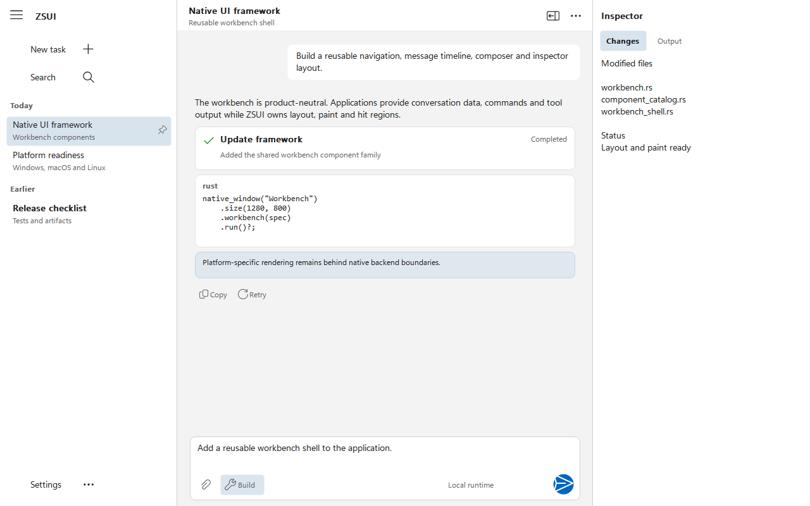
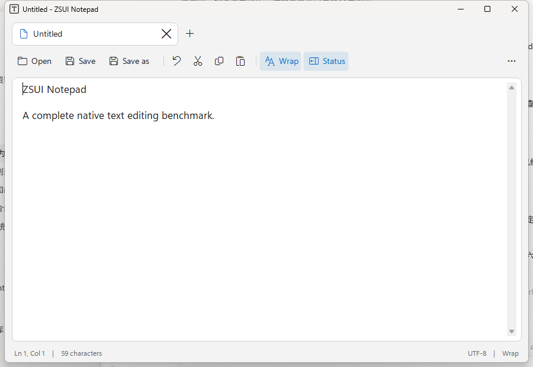
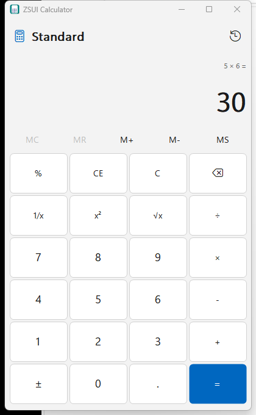
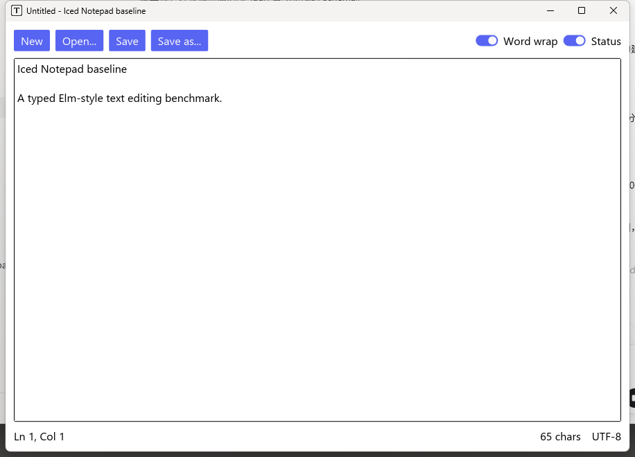
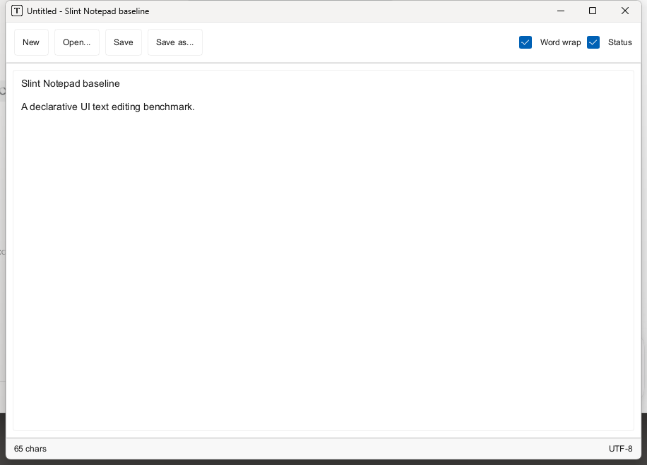
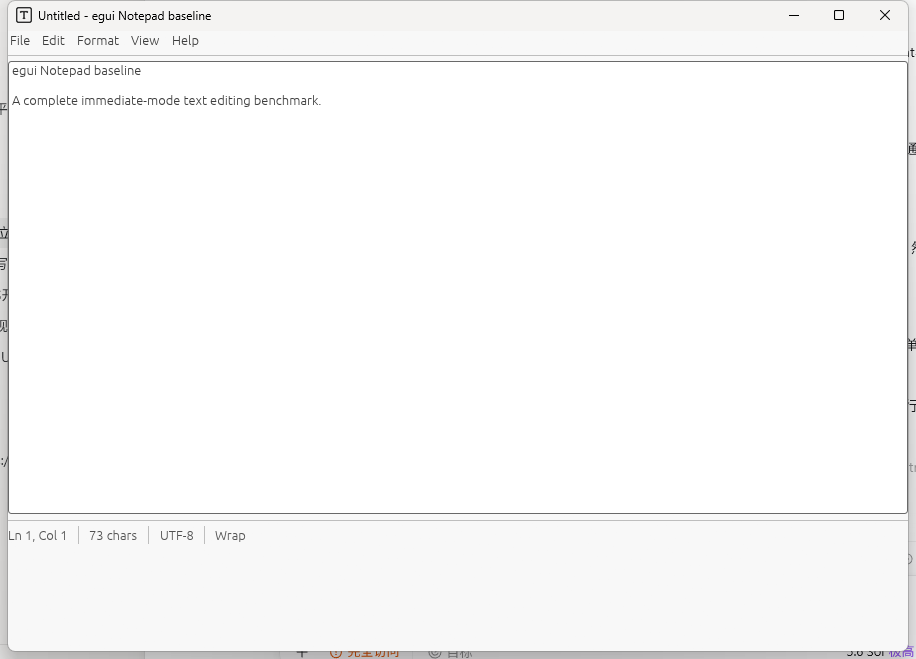
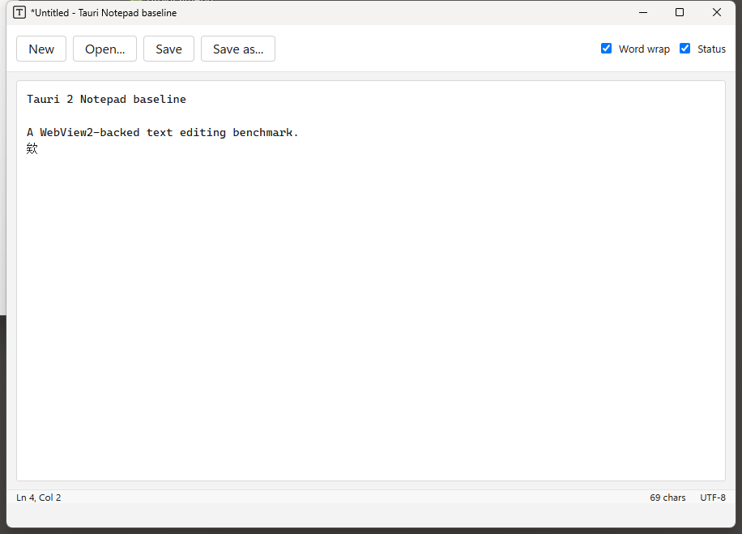
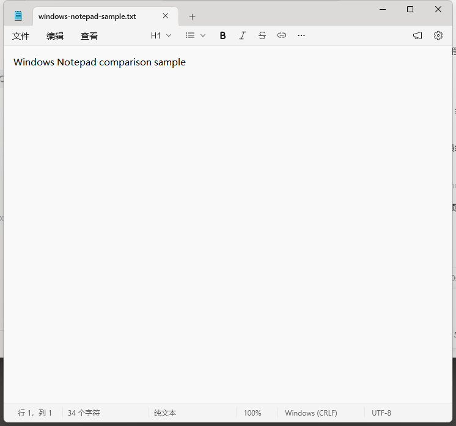
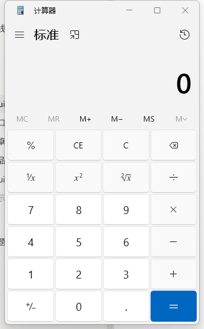

<div align="center">

# ZSUI

**Rust-first 的轻量原生 UI 框架**

用组合与 trait 构建界面，用强类型消息驱动状态；控件、服务和平台后端按 Cargo feature 进入编译。

[](https://github.com/qiu7824/zsui/actions/workflows/ci.yml)

[](LICENSE)


**简体中文** | [English](README.en.md)

</div>

<p align="center">
  
</p>

<table>
  <tr>
    <td width="68%"></td>
    <td width="32%"></td>
  </tr>
  <tr>
    <td align="center">现代文档外壳 + 原生文本服务</td>
    <td align="center">现代标准计算器</td>
  </tr>
</table>

<p align="center"><a href="docs/gallery.md"><b>查看完整 Demo 与对比图库</b></a></p>

<details>
<summary><b>展开 ZSUI / egui / Iced / Slint / Tauri 2 / Windows 对比图</b></summary>

<h4>记事本</h4>
<table>
  <tr><th>ZSUI</th><th>Iced</th><th>Slint</th></tr>
  <tr>
    <td></td>
    <td></td>
    <td></td>
  </tr>
</table>
<table>
  <tr><th>eframe / egui</th><th>Tauri 2</th><th>Windows Notepad</th></tr>
  <tr>
    <td></td>
    <td></td>
    <td></td>
  </tr>
</table>

<h4>计算器</h4>
<table>
  <tr><th>ZSUI</th><th>Windows Calculator</th></tr>
  <tr>
    <td></td>
    <td></td>
  </tr>
</table>

</details>

## 项目定位

ZSUI 不是浏览器壳，也不是对 WinUI 3 的运行时封装。它的目标是用 Rust
建立一套轻量、可组合、可裁剪的原生 UI 能力：

- 公共 API 安全，平台 `unsafe` 留在后端内部
- 组合和 trait 代替控件继承树
- 枚举和强类型 ID 代替字符串事件与全局注册表
- `State -> View -> Msg -> update` 显式状态循环
- `Dp`、`Px`、`Dpi` 和主题 token 管理布局与视觉
- 窗口、图标、位图和托盘资源由 RAII 管理
- 控件、服务、渲染器和平台能力通过 Cargo feature 按需编译
- 平台差异通过 capability/host trait 表达，不制造虚假的完全统一

Windows 是当前最完整的真实运行路径，包含 Win32 原生窗口、缓冲无闪屏绘制、
GDI+ 抗锯齿圆角、DPI、语义图标、输入路由和应用外壳。macOS/Linux 当前是
第一阶段桌面运行路径；Android/Harmony 仍处于宿主与设备验证建设阶段。

## 平台原生图标

应用和控件只使用 `ZsIcon` 语义值，不直接写字体私有码点。Windows 运行时先检测
系统的 Segoe Fluent Icons，不存在时使用 Windows 10 自带的 Segoe MDL2 Assets；
仓库不携带这两套字体。macOS 使用 SF Symbols 名称，Linux 使用当前 GTK 图标主题
的 symbolic 名称。系统源找不到图标时，可使用 `fluent-icons` 提供的 MIT Fluent
System Icons SVG 子集作为回退。

Windows 字体检测和 GDI 绘制已经接入真实运行路径。macOS 的 AppKit `NSImage`
查找和 Linux 的 `GtkIconTheme` 查找要随对应原生宿主完成，因此 capability 仍标记
为 partial，不会因为已有名称映射就标记为完成。详见
[平台原生图标](docs/native-icons.md)。

## 一句话创建原生窗口

```rust,no_run
fn main() -> zsui::ZsuiResult<()> {
    zsui::native_window("Example")
        .size(900, 620)
        .run()?;
    Ok(())
}
```

普通应用不需要接触 `HWND`、消息循环或 GDI 句柄。

输入控件继续沿用同一套强类型消息，例如按步长约束的 Slider：

```rust,no_run
use zsui::{slider, SliderRange, ViewNode};

#[derive(Clone)]
enum Msg {
    VolumeChanged(f32),
}

fn volume_control(value: f32) -> ViewNode<Msg> {
    slider(value, SliderRange::new(0.0, 100.0).step(5.0))
        .on_slide(Msg::VolumeChanged)
}
```

保持按下状态的 ToggleButton 也是独立可选组件；状态由应用显式持有，点击或
Space 都通过同一强类型消息返回：

```rust,no_run
use zsui::{toggle_button, ViewNode};

#[derive(Clone)]
enum Msg { PinChanged(bool) }

fn pin_button(checked: bool) -> ViewNode<Msg> {
    toggle_button("Pin panel", checked).on_toggle(Msg::PinChanged)
}
```

可编辑数值输入同样是独立的可选组件；草稿与已提交值分离，输入过程中不会被
格式化逻辑反复改写：

```rust,no_run
use zsui::{number_box, ViewNode, ZsNumberRange};

#[derive(Clone)]
enum Msg { AmountChanged(Option<f64>) }

fn amount_control(value: Option<f64>) -> ViewNode<Msg> {
    number_box(value, ZsNumberRange::new(0.0, 1000.0).step(0.5).large_step(10.0))
        .fraction_digits(1)
        .on_number_change(Msg::AmountChanged)
}
```

密码输入使用独立的 `password-box` feature。`ZsPassword` 在释放时清零自己持有的
字符串分配，`Debug` 固定脱敏且不实现序列化；默认掩码、IME 预编辑报告、事件 JSON
和绘制计划都不携带明文。Windows 的眼睛按钮是按住临时显示，macOS 与 GTK 默认
完全隐藏，三者都复用 ZSUI 的自绘树而不是嵌入平台子控件：

```rust,no_run
use zsui::{password_box, ViewNode, ZsPassword, ZsPasswordRevealMode};

#[derive(Clone)]
enum Msg { PasswordChanged(ZsPassword) }

fn password_control(value: &ZsPassword) -> ViewNode<Msg> {
    password_box(value)
        .reveal_mode(ZsPasswordRevealMode::Peek)
        .on_password_change(Msg::PasswordChanged)
}
```

RadioButton 不维护全局注册表；同一 `row` 或 `column` 的直接子项会形成局部分组，
框架即时保证互斥，并按 WinUI 规则提供单一 Tab 停靠点和不循环的方向键导航；
普通方向键让选择跟随焦点，Ctrl+方向键只移动焦点。应用仍用显式状态持久化最终
选择：

```rust,no_run
use zsui::{radio_button, ViewNode};

#[derive(Clone, Copy, PartialEq)]
enum Mode { Balanced, Performance }

#[derive(Clone)]
enum ModeMsg { Choose(Mode) }

fn mode_option(mode: Mode, current: Mode) -> ViewNode<ModeMsg> {
    let label = match mode { Mode::Balanced => "Balanced", Mode::Performance => "Performance" };
    radio_button(label, current == mode).on_choose(ModeMsg::Choose(mode))
}
```

确定进度使用独立范围，不需要启用 Slider：

```rust,no_run
use zsui::{progress_bar, ProgressRange, ViewNode};

fn download_progress(percent: f32) -> ViewNode<()> {
    progress_bar(percent, ProgressRange::new(0.0, 100.0))
}
```

环形等待反馈使用独立的 `progress-ring` feature；不需要把 ProgressBar 一起打包：

```rust,no_run
use zsui::{progress_ring, ViewNode, ZsProgressRingSpec};

fn connecting() -> ViewNode<()> {
    progress_ring(ZsProgressRingSpec::indeterminate())
}
```

ComboBox 的选中项和展开状态同样由应用显式持有；弹层选项通过强类型消息回传：

```rust,no_run
use zsui::{combo_box, ViewNode};

#[derive(Clone)]
enum Msg { Selected(usize), Expanded(bool) }

fn mode_picker(selected: Option<usize>, expanded: bool) -> ViewNode<Msg> {
    combo_box(["均衡", "性能", "安静"], selected)
        .expanded(expanded)
        .on_select(Msg::Selected)
        .on_expanded_change(Msg::Expanded)
}
```

组合框获得键盘焦点后可直接输入选项前缀；Win32、AppKit 和 GTK4 共用一秒的
大小写不敏感搜索缓冲，重复输入同一字符会从当前项继续循环，并仍通过
`on_select` 的强类型消息更新应用状态。长选项弹层按 WinUI 默认最多显示
15 项，并继续受当前窗口可用空间约束；初次展开会保证选中项可见，鼠标滚轮
通过框架内部强类型事件滚动可见窗口，不要求应用维护滚动偏移，也不依赖
`scroll` feature。

Tabs 使用独立的 `ZsTabId` 作为身份，标签文字不是事件键；只有当前页面参与
布局、绘制、命中测试和事件分发。Windows 上方向键只移动页签焦点，按
Enter/Space 选中，Ctrl+Tab 循环切换；AppKit 方向键直接切换页面，GTK4 用
方向键/Home/End 移动页签焦点、Space 选中，并支持 Ctrl+PageUp/PageDown
切页。应用代码不需要平台 `cfg`：

```rust,no_run
use zsui::{tab_view, text, ViewNode, WidgetId, ZsTabId, ZsTabItem};

#[derive(Clone)]
enum Msg { SelectTab(ZsTabId) }

fn pages(selected: ZsTabId) -> ViewNode<Msg> {
    tab_view([
        ZsTabItem::new(ZsTabId::new(1), "常规", text("常规设置")),
        ZsTabItem::new(ZsTabId::new(2), "高级", text("高级设置")),
    ], Some(selected))
        .id(WidgetId::new(10))
        .on_tab_select(Msg::SelectTab)
}
```

## 强类型状态与消息

```rust,no_run
use zsui::{button, column, native_window, text, AppCx, ViewNode, WidgetId};

struct State {
    count: u32,
}

#[derive(Clone)]
enum Msg {
    Increment,
}

fn view(state: &State) -> ViewNode<Msg> {
    column([
        text(format!("Count: {}", state.count)),
        button("Increment")
            .id(WidgetId::new(1))
            .on_click(Msg::Increment),
    ])
}

fn update(state: &mut State, msg: Msg, _cx: &mut AppCx) {
    match msg {
        Msg::Increment => state.count += 1,
    }
}

fn main() -> zsui::ZsuiResult<()> {
    native_window("Counter")
        .size(480, 320)
        .stateful_view(State { count: 0 }, view, update)
        .run()?;
    Ok(())
}
```

状态所有权、消息来源和修改入口都可以被 Rust 与 rust-analyzer 检查。

## 按需编译

直接从 GitHub 使用：

```toml
[dependencies]
zsui = { git = "https://github.com/qiu7824/zsui", default-features = false, features = [
    "window",
    "button",
    "label",
    "scroll",
    "list",
    "dark-mode",
] }
```

高级能力独立开启：

```toml
zsui = { git = "https://github.com/qiu7824/zsui", default-features = false, features = [
    "workbench",
    "document-shell",
    "calculator",
    "windows-gdi",
] }
```

未开启的可选依赖不会进入构建；同一依赖图中的 Cargo feature 会取并集，因此
ZSUI 的目标是保持默认集合小、重依赖 optional，并在接口稳定后继续拆分较大的
控件与后端模块。这里承诺的是 feature/crate 级按需编译，不宣称编译器能自动
删除已启用 crate 中的每一个未调用符号。`grid`、`toggle-button`、`number-box`、
`password-box`、`tooltip`、`dialog`、`tree`、`table`、`progress-ring`、`tabs`、`date-picker`、`time-picker` 等控件均可单独
开启；`all-widgets` 和 `full` 只在应用显式选择时才会打包全部能力。

## 已有应用外壳

| 能力 | 当前内容 | Feature |
| --- | --- | --- |
| 导航/卡片外壳 | 左侧导航、右侧内容、分组卡片、设置项、说明、操作区、滚动条 | `settings` / `full` |
| 工作台 | 会话导航、消息块、代码/工具块、编辑区、检查器 | `workbench` |
| 文档外壳 | 标签、命令栏、编辑器边框、状态栏、稳定命中区域 | `document-shell` |
| 计算器 | Decimal 运算、内存、历史、Fluent 键盘布局、语义图标 | `calculator` |
| 基础 View | 文本、按钮、保持状态按钮、强类型二维 Grid、文本/密码输入、附着式提示、模态对话框、复选、开关、滑块、可编辑数值框、单选、进度条/进度环、组合框、自绘日期/时间选择、标签页、树、数据表格、列表、滚动和强类型事件 | 对应 widget feature |
| 分页虚拟列表 | 可见区绘制、后台预取、请求去重、LRU 页缓存、稳定锚点 | `paged-list` |

组件目录当前记录 48 个 WinUI 风格家族：38 个已有第一阶段运行面，3 个只有
契约，7 个尚未开始。独立 `grid` feature 已提供固定/比例轨道、独立行列间距、
强类型显式单元格/跨度、DPI 缩放以及共享绘制/命中几何。DatePicker 已具备强类型日期、范围约束、本地时区“今天”标记、
窗口边缘自动翻转与水平约束的日历弹层、外部点击与焦点丢失关闭、点击与键盘路由、
语义主题绘制、跨 Win32/AppKit/GTK4 的自绘悬停与按下/高对比度状态，以及 Windows
WinUI 3 风格普通与高对比度 smoke；Tabs 已具备强类型标签 ID、单一活动页、
三平台原生键盘策略、自绘平台指标及 Windows 指针/键盘 smoke；TimePicker 已具备
强类型 `ZsTime`、可验证的分钟步长、12/24 小时格式、自绘平台指标、共享弹层放置、
指针/键盘选择及 Windows 实机 smoke。NumberBox 已提供可验证的有限数值范围、小/大
步长、空值、编辑草稿、提交/取消、三平台自绘指标及 Windows 实机 smoke。ToggleButton
已具备显式布尔状态、三平台自绘指标、悬停/按下反馈、点击与 Space 路由及 Windows
实机 smoke。PasswordBox 已提供脱敏值/事件/绘制协议、Unicode 编辑与 IME 掩码、
三平台自绘指标和 Windows 按住临时显示的实机 smoke；Alt+F8、完整无障碍和
macOS/GTK 实机证据仍是明确缺口。TreeView 和只读 DataGrid 已具备强 ID、应用所有
状态、三平台自绘指标与 Windows 交互 smoke，但无障碍、编辑/多选、虚拟化及
AppKit/GTK 目标机证据仍待补齐。它们都保持独立 feature，不会用组合外壳冒充
WebView 等尚未完成的独立控件。
ToolTip 通过 `.tooltip(...)` 或 `.tooltip_spec(...)` 附着到具有稳定 ID 的节点，
不增加命中目标，也不嵌入平台子控件。它按 Windows/macOS/GTK 内部指标自绘，支持
延迟悬停、键盘焦点立即显示、自动翻转/窗口内约束和定时关闭；Windows 已有真实
缓冲绘制截图，跨窗口边界弹出、完整无障碍关系和 macOS/GTK 目标机证据仍待完成。
独立 `dialog` feature 提供 `content_dialog(id, open, spec, page)` 组合式模态层。
应用持有开关状态并接收 `ZsContentDialogResult`，框架负责遮罩、焦点陷阱、语义按钮、
Escape/Tab/方向键/Enter/Space 路由和 Windows/macOS/GTK 各自的按钮顺序与尺寸。
整个对话框继续使用共享自绘树，不创建子 HWND、NSView 或 GtkWidget；Windows 已有
真实缓冲绘制与交互 smoke，自定义 View 内容、响应延迟、完整无障碍和 AppKit/GTK
目标机证据仍待完成。
独立 `progress-ring` feature 提供非交互的确定/不确定进度环，共享抗锯齿圆弧命令，
按 WinUI、AppKit 与 GTK4 的内部尺寸和速度配置自绘。三平台事件循环均由框架定时器
推进动画；Windows 已有真实缓冲绘制截图，macOS/GTK 目标机动画证据仍待补齐。

查看机器可读目录：

```rust
let summary = zsui::zsui_component_catalog_summary();
println!("{summary:#?}");
```

## 真实示例

### 三桌面统一示例

```powershell
cargo run --example desktop_native_showcase --features full
```

同一个 `State`、`Msg`、`view` 和 `update` 包含左侧导航、命令栏、单行/多行
输入、列表滚动、主题开关与原生菜单声明。统一入口现在分别进入 Win32、
`NSApplication` 和 `GtkApplication` 原生事件循环。Windows 已有真实 smoke 截图；
AppKit 与 GTK4 仍需按 [v0.2 原生 UI 应用闭环](docs/v0.2-desktop-native.md)
完成绘制、输入、截图和目标机交互证据。

### 十万行分页虚拟列表

```powershell
cargo run --example paged_virtual_list --no-default-features --features window,button,label,paged-list
```

示例只声明分页数据源、行视图和强类型消息。可见范围计算、后台连续预取、请求
去重、过期结果隔离和 5 页 LRU 缓存均由框架处理，详见
[分页虚拟列表](docs/paged-virtual-list.md)。

### 工作台

```powershell
cargo run --example workbench_shell --features full
```

### 现代记事本

```powershell
cargo run --example zsui_notepad --features notepad-demo
```

它组合自绘文档外壳和 Windows 原生多行文本服务，保留 IME 与原生编辑行为。
[测量说明](docs/notepad-demo.md)记录了代码量、包体和运行内存。

### 现代计算器

```powershell
cargo run --example zsui_calculator --no-default-features --features calculator-demo
```

标准模式包含四则运算、上下文百分比、连续等号、倒数、平方、开方、内存、
历史和键盘输入。一次本机 release 测量中，可执行文件为 0.28 MiB，任务管理器
私有工作集为 1.24 MiB；这只是可复现的单机观测，不是所有设备上的固定值。
[完整对比](docs/calculator-demo.md)同时记录了本机 Windows 计算器的独立进程与
窗口宿主进程，避免混用不同内存指标。

## 平台状态

| 平台 | 当前状态 | 说明 |
| --- | --- | --- |
| Windows | 真实运行路径 | Win32 窗口、缓冲绘制、输入、DPI、图标、托盘基础能力 |
| macOS | 原生宿主首轮 | 统一入口进入 NSApplication/NSWindow；绘制、输入、截图和目标机证据仍待完成 |
| Linux | 原生宿主首轮 | 统一入口进入 GtkApplication/ApplicationWindow；绘制、输入、Wayland/X11 截图和交互证据仍待完成 |
| Android | 宿主契约 | Activity/FFI 与真实设备运行仍待完成 |
| Harmony | 宿主契约 | Ability/FFI 与真实设备运行仍待完成 |

平台能力必须经过代码、目标机 smoke 和系统集成三层证据。仅有声明或脚手架时，
不会标记为完成。

## 为 AI 节约上下文

AI 不应该每次先读取整个仓库。ZSUI 提供了一个小型入口和按任务选择的上下文包：

1. 首次只读 [`docs/ai-agent.md`](docs/ai-agent.md)。
2. 查看可选任务包：

   ```powershell
   .\scripts\ai-context.ps1 -List
   ```

3. 选择当前任务，例如：

   ```powershell
   .\scripts\ai-context.ps1 -Pack calculator
   .\scripts\ai-context.ps1 -Pack windows-renderer -IncludeOptional
   ```

4. 只读取脚本返回的 required 文件；遇到阻塞再读取 optional 文件。

任务包清单位于 [`docs/ai/context-packs.json`](docs/ai/context-packs.json)。完整进度、
平台与接口参考被放在按需文档中，不再塞进默认 AI 首读文件。这与控件 feature
的思路一致：先加载最小核心，再按任务组合需要的上下文。

## 目录

- `src/`：公共 API、运行时、布局、协议和平台后端
- `examples/`：可运行的窗口、控件、工作台、记事本和计算器
- `docs/`：架构、目标机验证、应用测量和 AI 文档
- `docs/ai-agent.md`：AI 最小首读入口
- `docs/ai/context-packs.json`：AI 按需上下文包
- `scripts/check-feature-matrix.ps1`：全部公开 feature 检查
- `scripts/ai-context.ps1`：按任务输出最小文件集合

核心边界请阅读：

- [架构](docs/architecture.md)
- [Rust-first 目标](docs/framework-goals.md)
- [平台宿主约束](docs/porting.md)
- [目标机验证](docs/native-host-smoke.md)

## 验证

```powershell
cargo fmt --check
cargo test --no-default-features
cargo test --features full
.\scripts\ai-context.ps1 -Validate
.\scripts\check-feature-matrix.ps1 -Locked
```

CI 同时检查默认/无默认 feature、Windows 全功能构建、feature 矩阵，以及
Linux/macOS 桌面目标。

## 当前边界

- Windows 仍需更完整的 UI Automation、暗色、系统高对比度实时切换和高级输入证据
- 通用文本编辑器、文件对话框和文档生命周期服务仍需继续收口
- DatePicker、TreeView、DataGrid 与 ContentDialog 的第一阶段运行面仍缺完整无障碍、高级交互和 AppKit/GTK4 目标机证据；WebView 等高级控件尚未实现
- macOS、Linux、Android 和 Harmony 需要真实目标机运行与截图证据
- 大型控件/后端将在公共契约稳定后继续拆分 crate 或 feature 模块

## 赞赏支持

如果这个项目对你有帮助，欢迎支持我继续完善 Rust 原生 UI 能力。


## 许可证

本项目使用 [MPL-2.0](LICENSE) 许可证。
内置的 Fluent System Icons SVG 回退资源使用 MIT 许可证，详见
[第三方许可说明](THIRD_PARTY_NOTICES.md)。
