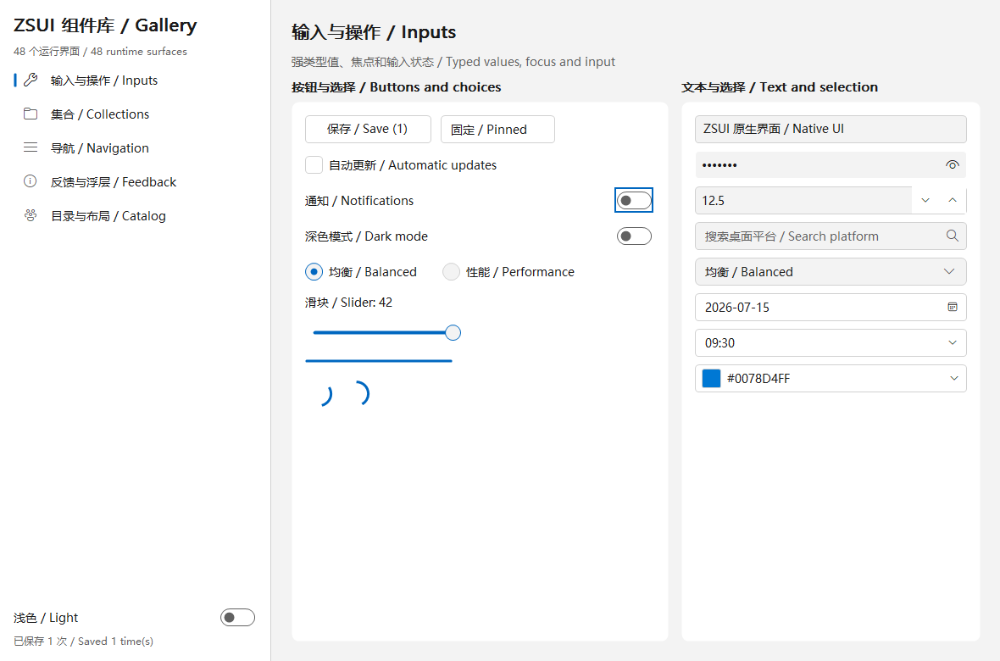
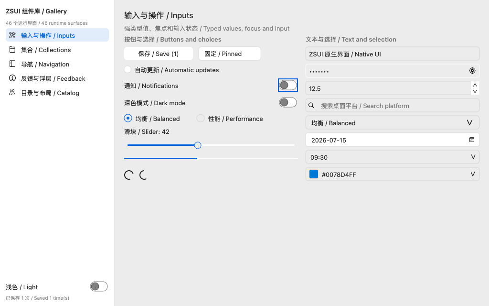
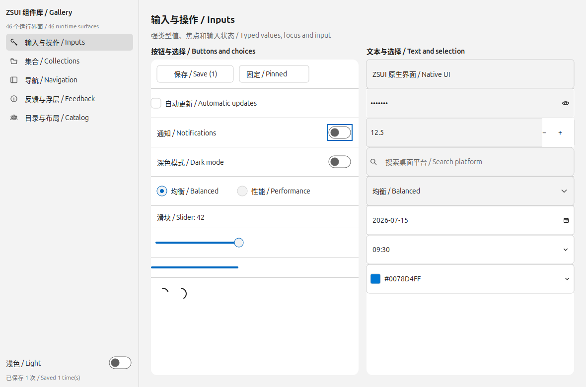
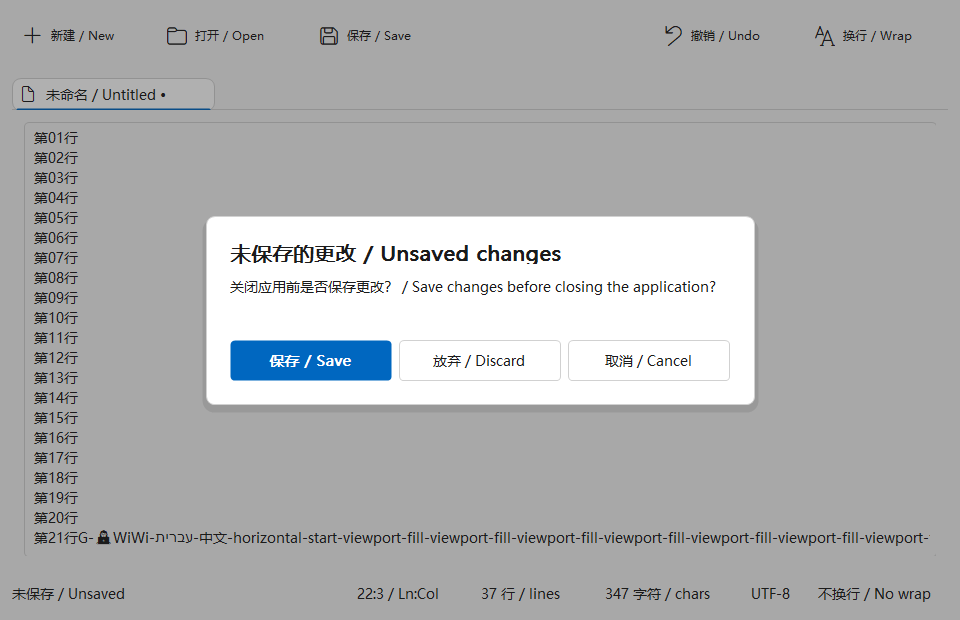
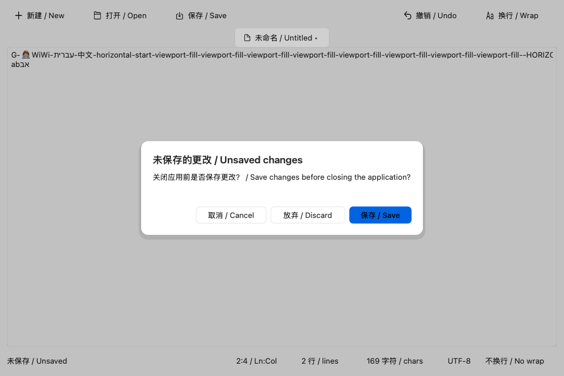
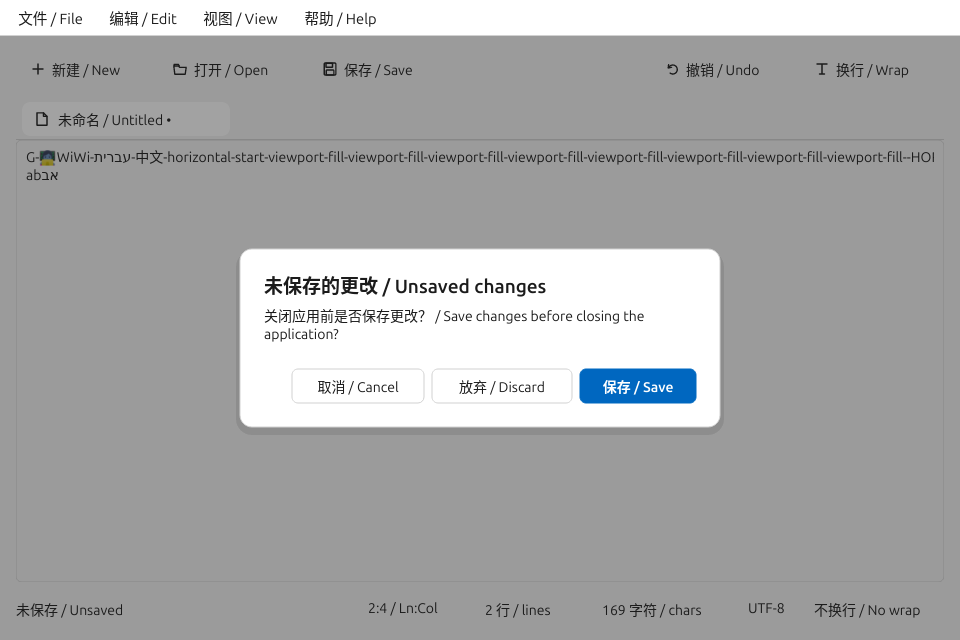
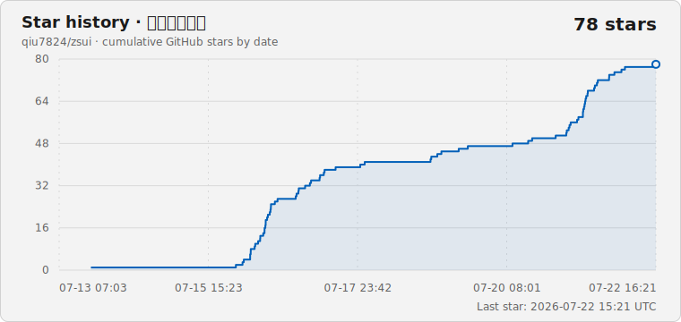

<div align="center">

# ZSUI

**Rust-first 的轻量原生 UI 框架**

用组合与 trait 构建界面，用强类型消息驱动状态；控件、服务和平台后端按 Cargo feature 进入编译。

[](https://github.com/qiu7824/zsui/actions/workflows/ci.yml)

[](LICENSE)


<a href="README.md"><strong>简体中文</strong></a>
&nbsp;&nbsp;·&nbsp;&nbsp;
<a href="README.en.md">English</a>

<p>
  <strong>由 Codex × GPT-5.6 协作构建</strong><br>
  从代码库分析与 Rust 实现，到测试验证、跨平台审查和发布，Codex 与 GPT-5.6 贯穿 ZSUI 的工程闭环。<br>
  每项变更仍以编译结果、自动化测试和目标平台证据为准。
</p>

</div>

## 同一份源码，三平台真实界面

普通应用只写一份 `State / Msg / view / update` 和语义组件声明。框架内部再分别选择
Win32、AppKit 与 Linux 的组合规则、文字栈、渲染器、窗口宿主和系统服务；应用层
不传平台枚举、不选择渲染器，也不维护三份 View 树。

<table>
  <tr><th>Windows · Win32</th></tr>
  <tr>
    <td></td>
  </tr>
  <tr>
    <td align="center">Fluent 导航与卡片</td>
  </tr>
  <tr><th>macOS 15 · AppKit</th></tr>
  <tr>
    <td></td>
  </tr>
  <tr>
    <td align="center">AppKit source list 与表单节奏</td>
  </tr>
  <tr><th>Ubuntu 24.04 · Linux</th></tr>
  <tr>
    <td></td>
  </tr>
  <tr>
    <td align="center">Linux sidebar 与 boxed rows</td>
  </tr>
</table>

上图是同一套 Gallery 语义声明产生的实际窗口截图，不是把 Windows 皮肤换色后复用。
Windows 图为本机 Win32 最终缓冲表面；macOS 图来自 `macos-15` Runner 的最终
`NSView`；Linux 图来自 Ubuntu 24.04 X11 的最终 Softbuffer 表面。Windows Gallery
与 Linux Gallery 使用 1180×780，macOS Gallery 使用 1024×640，因此这里比较
平台组合与组件风格，不是逐像素基准。

<details>
<summary><b>展开同一 Notepad 交互场景与 Linux 双渲染配置</b></summary>

<h4>同一窗口规格的未保存确认场景</h4>
<table>
  <tr><th>Windows · Win32</th></tr>
  <tr>
    <td></td>
  </tr>
  <tr><th>macOS 15 · AppKit</th></tr>
  <tr>
    <td></td>
  </tr>
  <tr><th>Ubuntu 24.04 · Linux</th></tr>
  <tr>
    <td></td>
  </tr>
</table>

三张图由同一个 `examples/zsui_notepad.rs` 场景驱动，均完成输入、选择、撤销、
滚动、关闭请求和未保存拦截；对话框动作顺序、工具栏、标签页、字体与窗口表面由
各平台规则决定。对应结构化 JSON 与图片一起保存在 `docs/platform-proof/`。

<h4>Linux 默认文字栈与纯 Rust 可裁剪配置</h4>
<table>
  <tr><th>Cairo + Pango</th></tr>
  <tr>
    <td></td>
  </tr>
  <tr><th>tiny-skia + cosmic-text/swash</th></tr>
  <tr>
    <td></td>
  </tr>
</table>

两种 Linux 配置复用完全相同的应用代码和平台体验层，只替换框架内部的文字与
光栅 profile。5 次采样中，纯 Rust 配置中位 RSS 为 15.77 MiB，默认配置为
25.32 MiB；完整测量见
[UI Memory Comparison #21](https://github.com/qiu7824/zsui/actions/runs/29677560838)。

</details>

这些目标机证据由
[Native UI Proof](https://github.com/qiu7824/zsui/actions/workflows/native-proof.yml)
持续生成；共享 `DrawPlan` 图片不能替代最终平台表面截图。

<table>
  <tr>
    <td width="68%"></td>
    <td width="32%"></td>
  </tr>
  <tr>
    <td align="center">现代文档外壳 + 原生文本服务</td>
    <td align="center">现代标准计算器</td>
  </tr>
</table>

<p align="center"><a href="docs/gallery.md"><b>查看完整 Demo 与对比图库</b></a></p>

<details>
<summary><b>展开 ZSUI / egui / Iced / Slint / Tauri 2 / Windows 对比图</b></summary>

<h4>记事本</h4>
<table>
  <tr><th>ZSUI</th><th>Iced</th><th>Slint</th></tr>
  <tr>
    <td></td>
    <td></td>
    <td></td>
  </tr>
</table>
<table>
  <tr><th>eframe / egui</th><th>Tauri 2</th><th>Windows Notepad</th></tr>
  <tr>
    <td></td>
    <td></td>
    <td></td>
  </tr>
</table>

<h4>计算器</h4>
<table>
  <tr><th>ZSUI</th><th>Windows Calculator</th></tr>
  <tr>
    <td></td>
    <td></td>
  </tr>
</table>

</details>

## 项目定位

ZSUI 不是浏览器壳，也不是对 WinUI 3 的运行时封装。它的目标是用 Rust
建立一套轻量、可组合、可裁剪的原生 UI 能力：

- 公共 API 安全，平台 `unsafe` 留在后端内部
- 组合和 trait 代替控件继承树
- 枚举和强类型 ID 代替字符串事件与全局注册表
- 可交互组件在布局时按 View 树路径获得稳定的自动 `WidgetId`；只有跨重排保存身份、
  组件互相引用或外部命令定向控件时才需要显式 `.id(...)`
- `State -> View -> Msg -> update` 显式状态循环
- `Dp`、`Px`、`Dpi` 和主题 token 管理布局与视觉
- 窗口、图标、位图和托盘资源由 RAII 管理
- 控件、服务、渲染器和平台能力通过 Cargo feature 按需编译
- 应用层写法完全统一；平台实现与能力差异由 framework-owned experience、host
  trait 和 capability 报告在框架内部真实表达

Windows 是当前最完整的真实运行路径，包含 Win32 原生窗口、缓冲无闪屏绘制、
GDI+ 抗锯齿圆角、DPI、语义图标、输入路由和应用外壳。macOS/Linux 已进入
真实窗口、最终表面截图和结构报告的持续 CI 验收阶段；Android 仍处于宿主与设备
验证建设阶段。

## 平台原生图标

应用和控件只使用 `ZsIcon` 语义值，不直接写字体私有码点。Windows 运行时先检测
系统的 Segoe Fluent Icons，不存在时使用 Windows 10 自带的 Segoe MDL2 Assets；
仓库不携带这两套字体。macOS 使用 SF Symbols 名称；Linux `linux-direct` 默认使用
内置 Cairo symbolic 矢量图标，避免轻量应用仅为 SVG 图标常驻整套解码动态库。
需要精确跟随当前 freedesktop 图标主题时可启用 `linux-system-icons`，`linux-gtk`
兼容后端继续使用 GTK 图标主题。系统源找不到图标时，可使用 `fluent-icons`
提供的 MIT Fluent System Icons SVG 子集作为回退。

Windows 字体检测和 GDI 绘制已经接入真实运行路径。macOS 的 AppKit `NSImage`
查找、Linux 的 freedesktop/GTK 主题查找及最终像素输出仍分别经过目标机证明，因此
capability 保持 partial，不会因为只有名称映射就标记为完成。详见
[平台原生图标](docs/native-icons.md)。

## 一句话创建原生窗口

```rust,no_run
#![cfg_attr(all(windows, not(debug_assertions)), windows_subsystem = "windows")]

fn main() -> zsui::ZsuiResult<()> {
    zsui::native_window("Example")
        .size(900, 620)
        .run()?;
    Ok(())
}
```

普通应用不需要接触 `HWND`、消息循环或 GDI 句柄。Windows 的 PE 子系统由最终
应用 crate 决定；面向用户的发布版应保留上面的 crate 属性，使双击启动时不创建
控制台窗口。debug 构建仍保留控制台，便于诊断。ZSUI 自带 GUI 示例和发布包通过
`scripts/check-windows-gui-subsystem.ps1` 检查这条边界。

输入控件继续沿用同一套强类型消息，例如按步长约束的 Slider：

```rust,no_run
use zsui::{slider, SliderRange, ViewNode};

#[derive(Clone)]
enum Msg {
    VolumeChanged(f32),
}

fn volume_control(value: f32) -> ViewNode<Msg> {
    slider(value, SliderRange::new(0.0, 100.0).step(5.0))
        .on_slide(Msg::VolumeChanged)
}
```

保持按下状态的 ToggleButton 也是独立可选组件；状态由应用显式持有，点击或
Space 都通过同一强类型消息返回：

```rust,no_run
use zsui::{toggle_button, ViewNode};

#[derive(Clone)]
enum Msg { PinChanged(bool) }

fn pin_button(checked: bool) -> ViewNode<Msg> {
    toggle_button("Pin panel", checked).on_toggle(Msg::PinChanged)
}
```

可编辑数值输入同样是独立的可选组件；草稿与已提交值分离，输入过程中不会被
格式化逻辑反复改写：

```rust,no_run
use zsui::{number_box, ViewNode, ZsNumberRange};

#[derive(Clone)]
enum Msg { AmountChanged(Option<f64>) }

fn amount_control(value: Option<f64>) -> ViewNode<Msg> {
    number_box(value, ZsNumberRange::new(0.0, 1000.0).step(0.5).large_step(10.0))
        .fraction_digits(1)
        .on_number_change(Msg::AmountChanged)
}
```

密码输入使用独立的 `password-box` feature。`ZsPassword` 在释放时清零自己持有的
字符串分配，`Debug` 固定脱敏且不实现序列化；默认掩码、IME 预编辑报告、事件 JSON
和绘制计划都不携带明文。Windows 的眼睛按钮是按住临时显示，macOS 与 GTK 默认
完全隐藏，三者都复用 ZSUI 的自绘树而不是嵌入平台子控件：

```rust,no_run
use zsui::{password_box, ViewNode, ZsPassword, ZsPasswordRevealMode};

#[derive(Clone)]
enum Msg { PasswordChanged(ZsPassword) }

fn password_control(value: &ZsPassword) -> ViewNode<Msg> {
    password_box(value)
        .reveal_mode(ZsPasswordRevealMode::Peek)
        .on_password_change(Msg::PasswordChanged)
}
```

RadioButton 不维护全局注册表；同一 `row` 或 `column` 的直接子项会形成局部分组，
框架即时保证互斥，并按 WinUI 规则提供单一 Tab 停靠点和不循环的方向键导航；
普通方向键让选择跟随焦点，Ctrl+方向键只移动焦点。应用仍用显式状态持久化最终
选择：

```rust,no_run
use zsui::{radio_button, ViewNode};

#[derive(Clone, Copy, PartialEq)]
enum Mode { Balanced, Performance }

#[derive(Clone)]
enum ModeMsg { Choose(Mode) }

fn mode_option(mode: Mode, current: Mode) -> ViewNode<ModeMsg> {
    let label = match mode { Mode::Balanced => "Balanced", Mode::Performance => "Performance" };
    radio_button(label, current == mode).on_choose(ModeMsg::Choose(mode))
}
```

确定进度使用独立范围，不需要启用 Slider：

```rust,no_run
use zsui::{progress_bar, ProgressRange, ViewNode};

fn download_progress(percent: f32) -> ViewNode<()> {
    progress_bar(percent, ProgressRange::new(0.0, 100.0))
}
```

环形等待反馈使用独立的 `progress-ring` feature；不需要把 ProgressBar 一起打包：

```rust,no_run
use zsui::{progress_ring, ViewNode, ZsProgressRingSpec};

fn connecting() -> ViewNode<()> {
    progress_ring(ZsProgressRingSpec::indeterminate())
}
```

ComboBox 的选中项和展开状态同样由应用显式持有；弹层选项通过强类型消息回传：

```rust,no_run
use zsui::{combo_box, ViewNode};

#[derive(Clone)]
enum Msg { Selected(usize), Expanded(bool) }

fn mode_picker(selected: Option<usize>, expanded: bool) -> ViewNode<Msg> {
    combo_box(["均衡", "性能", "安静"], selected)
        .expanded(expanded)
        .on_select(Msg::Selected)
        .on_expanded_change(Msg::Expanded)
}
```

组合框获得键盘焦点后可直接输入选项前缀；Win32、AppKit 和 Linux 共用一秒的
大小写不敏感搜索缓冲，重复输入同一字符会从当前项继续循环，并仍通过
`on_select` 的强类型消息更新应用状态。长选项弹层按 WinUI 默认最多显示
15 项，并继续受当前窗口可用空间约束；初次展开会保证选中项可见，鼠标滚轮
通过框架内部强类型事件滚动可见窗口，不要求应用维护滚动偏移，也不依赖
`scroll` feature。

Tabs 使用独立的 `ZsTabId` 作为身份，标签文字不是事件键；只有当前页面参与
布局、绘制、命中测试和事件分发。Windows 上方向键只移动页签焦点，按
Enter/Space 选中，Ctrl+Tab 循环切换；AppKit 方向键直接切换页面，GTK4 用
方向键/Home/End 移动页签焦点、Space 选中，并支持 Ctrl+PageUp/PageDown
切页。标签页内容自动获得平台内容边距，文字与紧凑控件保持原生固有高度；窄窗口
会裁剪溢出的标签条，不会把标签文字压缩到平台最小宽度以下。应用代码不需要平台
`cfg`：

```rust,no_run
use zsui::{tab_view, text, ViewNode, WidgetId, ZsTabId, ZsTabItem};

#[derive(Clone)]
enum Msg { SelectTab(ZsTabId) }

fn pages(selected: ZsTabId) -> ViewNode<Msg> {
    tab_view([
        ZsTabItem::new(ZsTabId::new(1), "常规", text("常规设置")),
        ZsTabItem::new(ZsTabId::new(2), "高级", text("高级设置")),
    ], Some(selected))
        .id(WidgetId::new(10))
        .on_tab_select(Msg::SelectTab)
}
```

Flyout 接受任意 View 内容。应用只持有打开状态与强类型关闭结果；Windows 使用
Fluent Flyout 组合，macOS 使用 Popover 组合，Linux 使用 GTK Popover 组合，应用
代码不需要平台枚举：

```rust,no_run
use zsui::{button, column, flyout, Dp, ViewNode, WidgetId, ZsFlyoutDismissReason, ZsFlyoutSpec};

const FLYOUT: WidgetId = WidgetId::new(20);
const TARGET: WidgetId = WidgetId::new(21);

#[derive(Clone)]
enum Msg { Open, Apply, Dismissed(ZsFlyoutDismissReason) }

fn settings(open: bool) -> ViewNode<Msg> {
    let page = button("More settings").id(TARGET).on_click(Msg::Open);
    let content = column([
        button("Apply").on_click(Msg::Apply),
    ]);
    flyout(
        FLYOUT,
        open,
        TARGET,
        ZsFlyoutSpec::new(Dp::new(240.0), Dp::new(96.0)),
        content,
        page,
    )
    .on_flyout_dismiss(Msg::Dismissed)
}
```

## 强类型状态与消息

```rust,no_run
use zsui::{button, column, native_window, text, AppCx, ViewNode, WidgetId};

struct State {
    count: u32,
}

#[derive(Clone)]
enum Msg {
    Increment,
}

fn view(state: &State) -> ViewNode<Msg> {
    column([
        text(format!("Count: {}", state.count)),
        button("Increment")
            .id(WidgetId::new(1))
            .on_click(Msg::Increment),
    ])
}

fn update(state: &mut State, msg: Msg, _cx: &mut AppCx) {
    match msg {
        Msg::Increment => state.count += 1,
    }
}

fn main() -> zsui::ZsuiResult<()> {
    native_window("Counter")
        .size(480, 320)
        .stateful_view(State { count: 0 }, view, update)
        .run()?;
    Ok(())
}
```

状态所有权、消息来源和修改入口都可以被 Rust 与 rust-analyzer 检查。

常驻监控型应用可以启用隐藏窗口资源回收：

```rust,no_run
# use zsui::{native_window, spacer, AppCx, ViewNode};
# #[derive(Clone)] enum Msg {}
# struct State;
# fn view(_: &State) -> ViewNode<Msg> { spacer() }
# fn update(_: &mut State, msg: Msg, _: &mut AppCx) { match msg {} }
native_window("Monitor")
    .release_view_when_hidden()
    .stateful_view(State, view, update)
    .run()?;
# Ok::<(), zsui::ZsuiError>(())
```

窗口最小化或隐藏后，ZSUI 会释放 `View` 树、绘制/命中计划和临时输入缓存；应用状态、命令路由及应用持有的监控服务继续存活。窗口重新显示时，界面从保留的状态重新构建。

原生消息对话框也使用同一套安全类型：

```rust,no_run
use zsui::{
    DialogButtons, DialogLevel, NativeDesktopDialogService, NativeDialogService,
    NativeDialogSpec,
};

let response = NativeDesktopDialogService::new().show_native_dialog(
    &NativeDialogSpec::message("Save changes?", "Unsaved edits will be lost.")
        .level(DialogLevel::Warning)
        .buttons(DialogButtons::YesNoCancel),
)?;
# Ok::<(), zsui::ZsuiError>(())
```

应用只处理 `DialogResponse`；Windows 使用有所有者的 `MessageBoxW`，macOS 使用
`NSAlert` 窗口 Sheet，GTK 兼容后端使用 `GtkAlertDialog`。默认 Linux 轻量宿主调用
桌面提供的 Zenity 表面，并在提供者不存在时明确返回 `ZsuiError::Unsupported`。

## 按需编译

从 crates.io 使用：

```toml
[dependencies]
zsui = { version = "0.2.0-preview.6", default-features = false, features = [
    "window",
    "button",
    "label",
    "scroll",
    "list",
    "dark-mode",
] }
```

高级能力独立开启：

```toml
zsui = { version = "0.2.0-preview.6", default-features = false, features = [
    "workbench",
    "document-shell",
    "calculator",
    "window",
] }
```

未开启的可选依赖不会进入构建；同一依赖图中的 Cargo feature 会取并集，因此
ZSUI 的目标是保持默认集合小、重依赖 optional，并在接口稳定后继续拆分较大的
控件与后端模块。这里承诺的是 feature/crate 级按需编译，不宣称编译器能自动
删除已启用 crate 中的每一个未调用符号。`grid`、`toggle-button`、`number-box`、
`password-box`、`tooltip`、`dialog`、`toast`、`teaching-tip`、`info-bar`、`breadcrumb`、`grid-view`、`auto-suggest`、`color-picker`、`command-palette`、`tree`、`table`、`progress-ring`、`tabs`、`date-picker`、`time-picker` 等控件均可单独
开启；原生文本无障碍桥接也只在显式开启 `accessibility` 时进入编译，Win32 使用
UI Automation Edit/Value/TextPattern，macOS 使用 AppKit Accessibility，`linux-gtk`
兼容后端使用 GTK4 Accessibility；默认 `linux-direct` 通过 AccessKit 投影到 AT-SPI，
并由真实 Weston Wayland Runner 验证菜单与辅助功能事件。`linux-direct-lite` 复用同一
宿主桥接，但仍需独立补齐 Wayland/AT-SPI 运行证据。
这些路径均不嵌入平台子编辑器或 WebView。`all-widgets` 和 `full` 只在应用显式选择
时才会打包全部能力。

v0.2 的开发体验目标还包括一个版本化的语义 UI 文档、强类型绑定校验器和预编译
原生 Viewer：仅修改文字、token、布局和兼容组件树时，可以保存后直接重载，不调用
Cargo。`zsui-uic handoff` 可把验证后的文档、绑定 schema、值快照和可选原生 PNG
输出为稳定排序、无时间戳和绝对路径的 AI 交接目录；`zsui-uic embed` 则生成可由
`include_bytes!` 纳入二进制的确定性制品。独立 `ui-document-runtime` 把制品解码为共享
`ViewNode<Msg>`，自身不启用全部控件，也不携带 Viewer、文件监听、截图或额外进程。
UiDocument 的 `page_padding`、`content_padding` 和 `content_gap` 等语义间距在目标
平台解析；Text 可声明语义字阶、换行、省略、字重和对齐。共享布局会递归计入嵌套
容器的内边距、间距、子节点行框和控件最小尺寸，并按横向行中实际分配的宽度计算
多行文字高度，避免中英文被压缩、截断或覆盖相邻节点。
现有 Rust `view` builder 继续保留，完整
拖放式设计器不属于 v0.2 完成门槛，浏览器模拟也不能替代三平台真实运行证据。
可选 `ui-document` feature、`UiBindingManifest<State, Msg>` 和 `zsui-uic check`
负责验证 schema、组件 feature、稳定 ID、属性和绑定；可选 `ui-viewer` feature 则
提供已经编译好的原生 Viewer。Viewer 在同一个原生窗口中轮询文档变更，保留
`UiViewerState`，并把稳定节点 ID 映射为稳定 `WidgetId`，所以修改受支持的文字、
token、布局和组件树不需要重新运行 Cargo。同 ID 且控件状态类别兼容的重载会保留
原生焦点、文本选择和文本编辑器视口；删除节点、更换控件类型或在单行/多行文本框间
切换会生成确定性重置报告并清理不兼容的临时状态。格式、命令及当前覆盖范围见
[UI Document 文档](docs/ui-document.md)。
文本、切换、滑块、列表和滚动容器的带值动作已经通过按控件持有的类型化回调进入显式
Viewer 状态。`list` 以直接子节点的稳定 ID 作为选择值，因此项目重排不会改变语义身份；
`progress_ring` 用 nullable number 在确定与不确定进度间切换，并由平台 profile 决定尺寸
和动画；`password_box` 使用独立的 `ZsPassword` 状态/动作通道，拒绝文档字面量和
`values.json` 明文，Viewer、交接包、证明报告及普通动作日志只保留脱敏元数据。
`date_picker` 使用规范 ISO 日期绑定和强类型 `ZsDate` 映射，并把选中日期、可见月份及
展开状态作为三个显式受控槽位；日期选择和月份导航在热重建后不会回退。
`time_picker` 使用规范 `HH:MM` 状态格式和强类型 `ZsTime` 映射，分钟步长、平台默认或
显式时制以及选择/展开状态均经过 schema 与发布运行时校验；本地化显示文本不会进入状态。
`color_picker` 使用规范大写 `#RRGGBBAA` 和强类型 `Color` 映射；颜色、展开状态与活动
通道均可独立受控，alpha 策略在 schema 和发布运行时重复校验，而色谱、滑轨和弹层尺寸
继续由 WinUI、AppKit 或 GTK 体验参数解析。
`auto_suggest` 使用稳定语义字符串 ID 的建议数组，查询、可空高亮和展开状态均可独立
受控；选择和结构化提交经强类型绑定进入应用消息，发布运行时再确定性映射为内部
`ZsAutoSuggestionId`，因此建议重排和 Viewer 热重建不会改变项目身份。
`command_palette` 使用稳定语义字符串 ID 的命令数组，保留标题、副标题、关键字、快捷键、
语义图标和启用状态；查询、高亮和打开状态显式受控，调用只返回强类型命令 ID，不在
框架内执行产品行为。发布运行时使用节点作用域的私有数值 ID，命令重排不会改变身份。
`tree` 使用全树唯一的稳定语义字符串 ID、递归节点数组、完整展开集合和可空选择；选择、
展开与调用分别进入强类型消息，发布运行时才映射为私有 `ZsTreeNodeId`。折叠隐藏选中行、
节点重排或 Viewer 热重建都不会把状态退化为数组下标或平台控件模型。
`scroll` 以一个内容子树、显式内容高度、受控偏移和 number 动作构成闭环，布局
会夹取越界偏移；绑定后的状态在 View 重建后继续保留，不使用全局注册表。完整组件覆盖、
高级控件状态迁移和三平台固定 Viewer 证据仍是 v0.2 的完成门槛。

多语言是独立的 `localization` 服务 feature。应用持有 `ZsLocalizer`，使用稳定消息
ID、Fluent 参数/复数规则、Unicode locale 回退和系统语言检测；切换语言走普通的
强类型状态更新与 View 重建，不依赖全局可变翻译表。完整用法见
[多语言文档](docs/localization.md)。

## 已有应用外壳

| 能力 | 当前内容 | Feature |
| --- | --- | --- |
| 导航/卡片外壳 | 左侧导航、右侧内容、分组卡片、设置项、说明、操作区、滚动条 | `settings` / `full` |
| 工作台 | 会话导航、消息块、代码/工具块、编辑区、检查器 | `workbench` |
| 文档外壳 | 标签、命令栏、编辑器边框、状态栏、稳定命中区域、UTF-8/UTF-16 文本加载与事务式保存 | `document-shell` |
| 计算器 | Decimal 运算、内存、历史、三平台自适应键盘布局、语义图标 | `calculator` |
| 基础 View | 文本与输入、选择控件、弹层反馈、导航、日期时间、进度、列表、树和数据表格 | 按控件启用 |
| 图片预览 | 后台解码、请求合并、旧结果隔离、保留上一完整帧、原子换帧 | `image-preview` |
| 分页虚拟列表 | 可见区绘制、方向感知预取、请求去重、LRU 页缓存、同步重排锚点 | `paged-list` |

组件目录记录 48 个桌面控件家族，全部已有第一阶段运行面。Flyout 接受任意 View
内容，并由 Windows、macOS 与 Linux 的独立组件 profile 决定放置、圆角、箭头和间距。
控件均通过独立 Cargo feature 按需启用，并复用强类型状态、布局、绘制和事件协议。
详细能力与验证状态以 [`src/component_catalog.rs`](src/component_catalog.rs) 和
[`docs/v0.2-desktop-native.md`](docs/v0.2-desktop-native.md) 为准。

## 真实示例

### 三桌面统一示例

```powershell
cargo run --example desktop_native_showcase --features full
```

同一个 `State`、`Msg`、`view` 和 `update` 包含左侧导航、命令栏、单行/多行
输入、列表滚动、主题开关与原生菜单声明。统一入口现在分别进入 Win32、
`NSApplication` 和 Linux Wayland/X11 原生窗口事件循环。固定 CI 已真实启动 AppKit、
X11 与 Weston Wayland 窗口，导出最终平台表面截图和结构化运行报告；发布前的真实
输入法候选窗与人工辅助功能体验仍是单独验收门槛。

应用层使用 `section`、`navigation_view(ZsNavigationViewSpec)`、
`command_bar(ZsCommandBarSpec)` 和 `toolbar_button` 声明语义界面，不传平台枚举。
平台专用组合、度量和图标来源在框架内部解析；应用仍可通过公共 spec、
`ZsuiSpacingTokens::default()` 和 View 尺寸/间距修饰器统一修改参数，无需增加平台分支。
`navigation_view` 通过 `.content(WidgetId, ViewNode)` 同时拥有侧边栏和内容，框架内部
分别采用 WinUI Auto、AppKit 约束折叠和 Libadwaita split-view 规则；紧凑栏、最小模式、
覆盖层、焦点和收起交互不需要应用编写平台枚举或 `cfg`。

### 完整组件 Gallery

```powershell
cargo run --release --example component_gallery --no-default-features --features component-gallery-demo
```

Gallery 通过独立 profile 显式启用全部控件，包含输入、集合、导航、反馈、弹层、
布局和组件目录五页，界面文案同屏提供中文与英文。普通应用仍按控件 feature 选择
依赖；默认构建不打包完整组件集。
Windows 截图验收可追加 `-- --smoke --page inputs`，页面参数还支持
`collections`、`navigation`、`feedback` 和 `catalog`。

### 十万行分页虚拟列表

```powershell
cargo run --example paged_virtual_list --no-default-features --features window,button,label,paged-list
```

示例只声明分页数据源、行视图和强类型消息。可见范围计算、后台连续预取、请求
去重、过期结果隔离和 5 页 LRU 缓存均由框架处理，详见
[分页虚拟列表](docs/paged-virtual-list.md)。

### 无闪屏图片预览

```powershell
cargo run --example image_preview --no-default-features --features window,button,label,image-preview
```

预览状态在后台解码 PNG，只发布当前 generation 的完整帧；新图加载期间继续绘制
上一完整帧。Win32 将图片与其余绘制命令写入同一缓冲目标后统一提交，详见
[图片预览](docs/image-preview.md)。

### 工作台

```powershell
cargo run --example workbench_shell --features full
```

发票重命名工作台还提供 ZSUI、eframe/egui、Iced、Slint 和 Tauri 2 的同功能
[截图与 release 测量对比](docs/invoice-workbench-comparison.md)：

```powershell
cargo run --release --example invoice_workbench
```

### 现代记事本

```powershell
cargo run --example zsui_notepad --no-default-features --features notepad-demo
```

Linux 还可以从同一份应用源码选择不链接 Cairo/Pango 的纯 Rust 渲染配置：

```powershell
cargo run --example zsui_notepad_lite --no-default-features --features notepad-demo-lite
```

它用同一份 Rust `State / Msg / view / update` 代码运行在 Win32、AppKit 和 Linux
原生宿主上，组合自绘多行编辑器、原生菜单和原生文件对话框，并把三平台标题栏关闭
统一路由到强类型未保存确认。长文档视觉行/页导航、滚轮、边缘拖拽滚动、裁剪视口及
关闭软换行后的横向插入点自动显现由编辑器内部共享视口模型处理，不要求应用维护滚
动状态；Uniscribe、Core Text 和 Pango 的原生成形宽度统一驱动比例字体、双向文本
插入点、选择、换行和命中，组合附加符与连接 emoji 仍按完整字素处理，也不使用 WebView。
[验收与测量说明](docs/notepad-demo.md)记录了能力边界、代码量和验证方法。
仓库 CI 还会检查根包依赖图和 Rust 源码入口，阻止 WebView2、WKWebView、
WebKitGTK、Wry、Tauri 等浏览器壳能力进入 ZSUI；`comparisons/` 中隔离的基准不属于框架。

Ubuntu 24.04 固定双语场景的 5 次首帧空闲采样中，纯 Rust 配置的中位 RSS 为
15.77 MiB、私有 RSS 为 10.74 MiB、PSS 为 12.09 MiB，可执行文件为 5.14 MiB；
默认 Cairo/Pango 配置分别为 25.32、15.15、18.18 和 3.14 MiB。该结果来自
[UI Memory Comparison #21](https://github.com/qiu7824/zsui/actions/runs/29677560838)，
不代表所有发行版、字体集或显示服务器上的固定值。

### 现代计算器

```powershell
cargo run --example zsui_calculator --no-default-features --features calculator-demo
```

标准模式包含四则运算、上下文百分比、连续等号、倒数、平方、开方、内存、
历史和强类型交互。同一份 `State / Msg / view / update` 源码由 `window` 自动进入
Win32、AppKit 或 Linux 后台；应用不包含平台 `cfg`、原始句柄或平台事件循环。
[完整说明](docs/calculator-demo.md)记录了三平台入口、真实 Windows smoke 和本机
Windows Calculator 对比方法，并区分工作集、私有工作集与私有字节。

## 平台状态

| 平台 | 当前状态 | 说明 |
| --- | --- | --- |
| Windows | 真实运行路径 | Win32 窗口、缓冲绘制、输入、DPI、图标、托盘基础能力 |
| macOS | 原生运行与 CI 证据 | 统一入口进入 NSApplication/NSWindow；AppKit 最终 NSView 截图、输入、布局报告及 NSStatusItem 状态栏菜单已由 macos-15 Runner 验证 |
| Linux | 原生运行与 CI 证据 | 默认 `linux-direct` 创建真实 Wayland/X11 窗口并使用 Cairo/Pango；可选 `linux-direct-lite` 使用 cosmic-text/swash 与 tiny-skia 降低常驻内存；X11 最终表面及 Wayland/AT-SPI/菜单已有目标机证据 |
| Android | 宿主契约 | Activity/FFI 与真实设备运行仍待完成 |

平台能力必须经过代码、目标机 smoke 和系统集成三层证据。仅有声明或脚手架时，
不会标记为完成。

Linux 的“原生”指真实系统窗口、窗口管理器事件、系统字体/文字成形、输入法、
剪贴板、图标主题和桌面 portal 集成；ZSUI 控件仍是针对 Linux 平台参数自绘的
框架控件，不是 `GtkWidget`。因此它属于原生窗口上的自绘 UI，而不是 GTK 原生控件树。

## 目录

- `src/`：公共 API、运行时、布局、协议和平台后端
- `examples/`：可运行的窗口、控件、工作台、记事本和计算器
- `docs/`：架构、目标机验证、应用测量和 AI 文档
- `scripts/check-feature-matrix.ps1`：全部公开 feature 检查

核心边界请阅读：

- [架构](docs/architecture.md)
- [Rust-first 目标](docs/framework-goals.md)
- [0.3 Native Proof CI](docs/v0.3-native-proof-ci.md)
- [平台宿主约束](docs/porting.md)
- [目标机验证](docs/native-host-smoke.md)

## 验证

```powershell
cargo fmt --check
cargo test --no-default-features
cargo test --features full
.\scripts\check-feature-matrix.ps1 -Locked
```

CI 同时检查默认/无默认 feature、Windows 全功能构建、feature 矩阵，以及
Linux/macOS 桌面目标。

## 当前边界

- Windows 仍需更完整的 UI Automation、暗色、系统高对比度实时切换和高级输入证据
- 通用文本编辑器仍需继续收口；三平台原生成形宽度与双向插入点已统一驱动绘制/命中/选择/换行/滚动，上下视觉行导航保持目标 x，Left/Right 已按成形主光标的视觉 x 顺序移动；可选 `accessibility` 已接入 Win32 UIA Edit/Value/TextPattern（文档范围、选择、命中、成形矩形、查找、范围移动和滚动入视口）、AppKit 文本范围选择器和 GTK4 文本框语义，Windows 已有真实 HWND/UI Automation CI 探针，但 UIA 富文本属性/嵌入对象范围与 AppKit/GTK4 辅助技术目标机证据仍待完成；`ZsTextDocument` 已提供平台无关的文本编解码、脏状态和事务式保存生命周期
- DatePicker、TreeView、DataGrid 与 ContentDialog 的第一阶段运行面仍缺完整无障碍、高级交互和 AppKit/GTK4 目标机证据；嵌入式浏览器控件不在 v0.2 产品范围内
- macOS 与 Linux 已有真实目标机运行和最终表面截图；发布前仍需补充真实中文输入法
  候选窗、系统辅助技术和更多桌面环境的人工验收。Android 仍需真实设备证据
- 大型控件/后端将在公共契约稳定后继续拆分 crate 或 feature 模块

## 赞赏支持

如果这个项目对你有帮助，欢迎支持我继续完善 Rust 原生 UI 能力。


## 许可证

本项目使用 [MPL-2.0](LICENSE) 许可证。
内置的 Fluent System Icons SVG 回退资源使用 MIT 许可证，详见
[第三方许可说明](THIRD_PARTY_NOTICES.md)。

## 收藏量趋势图

<a href="https://github.com/qiu7824/zsui/stargazers">
  
</a>
