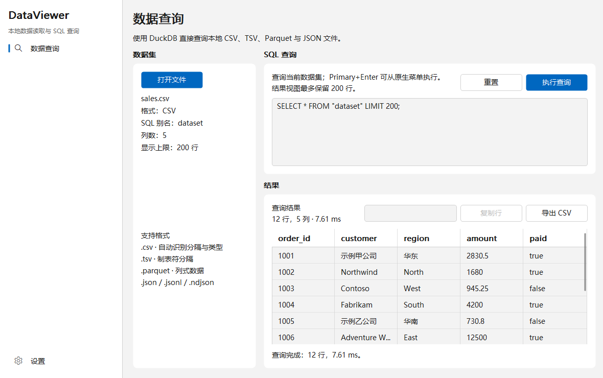

# ZSUI DataViewer Comparison

Cross-platform native data inspection application implemented with one shared
Rust state, message, view and update path. Product data access remains isolated
from the ZSUI framework crate.

## Supported workflow

- Open CSV, TSV, Parquet, JSON, JSONL and NDJSON through the target-native file
  dialog.
- Register the selected file as the DuckDB relation `dataset`.
- Edit and execute SQL with the native multiline editor and `Primary+Enter`.
- Inspect, sort, filter, select, copy and export up to 200 result rows.
- Follow the system appearance or select light/dark mode.
- Run the same source on Win32, AppKit and Linux Direct hosts.

## Run

```text
cd comparisons/zsui_dataviewer
cargo run --release
cargo run --release -- --sample
```

The second command opens the bundled deterministic CSV fixture. Native capture:

```text
cd comparisons/zsui_dataviewer
cargo run --release -- \
  --sample --smoke --screenshot target/dataviewer-smoke/window.png \
  --report target/dataviewer-smoke/report.json
```

The package uses the official DuckDB release library selected by
`DUCKDB_DOWNLOAD_LIB=1` in `.cargo/config.toml`. The native DuckDB library must
be included when measuring or distributing the complete application package.

The reproducible source totals and pinned reference revision are recorded in
[`CODE_SIZE.md`](CODE_SIZE.md). Same-host Windows runtime, package, dependency
and capability results are recorded in
[`WINDOWS_BASELINE.md`](WINDOWS_BASELINE.md).

## Current Windows evidence



The paired
[`loaded-default.json`](artifacts/windows-local/loaded-default.json) report
records one 1180 × 740 client surface captured through
`win32_wm_printclient_dib_png`, successful auto-close and native menu routing,
plus a 9-node/8-action Win32 UIA tree. The loaded-sample observation used
33.00 MiB resident and 9.11 MiB private memory at the pre-teardown sample
point; this single local observation is not a cross-machine benchmark.

## Comparison contract

The reference and ZSUI applications use the same 1180 × 760 logical window,
dataset, SQL text, theme and interaction state. Capture the following states on
each available target:

1. Empty light/system appearance.
2. Loaded dataset and default result.
3. Edited SQL and successful result.
4. Sorted, filtered and selected result.
5. SQL error InfoBar.
6. Settings page.
7. Dark appearance.
8. 800 × 520 resized window.
9. 150% scale where supported.
10. Large-result scrolling.

Each state produces a full-window image, aligned side-by-side composite,
50-percent alpha overlay and difference heatmap. Layout, text baselines,
control geometry and interaction state are scored separately from raw pixel
difference.

## Measurement matrix

| Dimension | Measurement |
| --- | --- |
| Source size | Physical and nonblank production lines, split into UI, state, data, platform integration and tests |
| Build | Clean release time, incremental check time and dependency count |
| Package | Executable and complete distributable directory bytes |
| Startup | Cold and warm time to first visible frame |
| Runtime | Idle, loaded and queried resident/private memory; idle CPU, threads and handles |
| Data | Open-to-preview latency and isolated DuckDB query latency |
| Interaction | Query-to-first-result frame, scroll, resize and theme-switch latency |
| Quality | Keyboard, Unicode/IME, accessibility, malformed input and repeated-operation behavior |

Generated code, lockfiles, vendored dependencies, build output, fixtures and
capture artifacts are excluded from source-line totals. The reference source is
measured at a pinned commit; the ZSUI result records the local Git commit and
dirty state.

## Platform evidence

| Target | Required evidence |
| --- | --- |
| Windows x64 | Release build, Win32 screenshot/report, UIA keyboard path and package measurements |
| macOS arm64 | Release build, AppKit screenshot/report, VoiceOver-oriented semantic audit and package measurements |
| Ubuntu x64 | Release build, X11 and Wayland screenshot/report, AccessKit/AT-SPI audit and package measurements |

Build success is not platform-complete evidence. Each row requires a real
target window, file dialog, text input, query, table interaction and final
surface capture.
