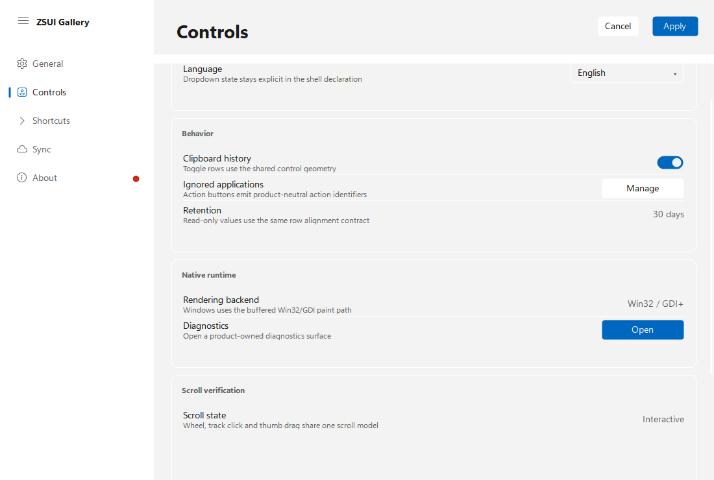
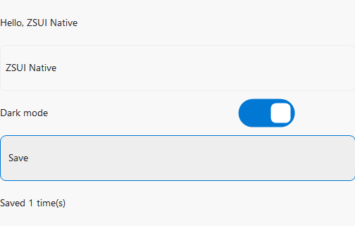

# ZSUI Demo Gallery / 示例图库

[简体中文 README](../README.md) | [English README](../README.en.md)

本页图片来自真实 Windows 窗口的 smoke 或对比脚本，不是设计稿。
These images are captured from real Windows smoke runs or comparison scripts,
not design mockups.

## Navigation And Grouped Cards / 导航与分组卡片



左侧导航、右侧内容、分组卡片、设置项、说明文字、操作按钮和滚动区域共享同一套
DPI 布局与命中模型。

The navigation rail, content pane, grouped cards, setting rows, descriptions,
actions and scrolling share one DPI-aware layout and hit-test model.

## Workbench / 工作台


工作台组合会话导航、消息内容、代码/工具块、操作区、编辑区和检查器，同时把业务
数据与命令留给应用。

The workbench composes navigation, messages, code/tool blocks, actions, a
composer and inspector while leaving product data and commands to the app.

## Typed Stateful View / 强类型状态界面

<p align="center">
  
</p>

真实点击会生成 `Msg`，进入 `update`，重建 View 并触发重绘。
Real input emits `Msg`, enters `update`, rebuilds the View and repaints.

## Application Demos / 应用示例

<table>
  <tr>
    <th>ZSUI Notepad / 记事本</th>
    <th>ZSUI Calculator / 计算器</th>
  </tr>
  <tr>
    <td width="68%"></td>
    <td width="32%"></td>
  </tr>
</table>

记事本使用自绘文档外壳与原生多行文本服务；计算器使用 Decimal 状态机、语义图标
和完全自绘键盘。

Notepad combines a self-drawn document shell with a native multiline text
service. Calculator uses a Decimal state machine, semantic icons and a fully
self-drawn keypad.

## Notepad Comparison / 记事本对比

<table>
  <tr>
    <th>ZSUI</th>
    <th>eframe / egui</th>
    <th>Windows Notepad</th>
  </tr>
  <tr>
    <td></td>
    <td></td>
    <td></td>
  </tr>
</table>

一次相同机器、5 秒预热后的任务管理器私有工作集观测：

| Implementation | App files | App lines | Binary | Task Manager memory |
| --- | ---: | ---: | ---: | ---: |
| ZSUI Notepad | 3 | 937 | 0.26 MiB | 1.84 MiB |
| eframe/egui baseline | 2 | 344 | 5.67 MiB | 43.61 MiB |
| Windows Notepad | system app | system app | package file* | 37.89 MiB |

完整方法、总工作集与 private bytes 见
[`notepad-demo.md`](notepad-demo.md)。这些数值是单机观测，不是所有设备上的固定值。

See [`notepad-demo.md`](notepad-demo.md) for methodology, total working set and
private bytes. These are observations from one machine, not universal constants.

## Calculator Comparison / 计算器对比

<table>
  <tr>
    <th>ZSUI Calculator</th>
    <th>Windows Calculator</th>
  </tr>
  <tr>
    <td></td>
    <td></td>
  </tr>
</table>

| Implementation | Processes | App files | App lines | Binary | Task Manager memory |
| --- | ---: | ---: | ---: | ---: | ---: |
| ZSUI Calculator | 1 | 2 | 442 | 0.28 MiB | 1.24 MiB |
| Windows `CalculatorApp` | 1 | system app | system app | package file* | 26.96 MiB |
| Windows visible process group | 2 | system app | system app | not comparable | 47.48 MiB |

这次 Windows 计算器的可见窗口由单独的 `ApplicationFrameHost` 持有，所以同时列出
应用进程和进程组。共享宿主的全部内存不能视为计算器独占。

The visible Windows Calculator window was owned by a separate
`ApplicationFrameHost` in this run, so both the app process and process group
are shown. A shared host is not entirely attributable to Calculator.

完整方法见 [`calculator-demo.md`](calculator-demo.md)。
See [`calculator-demo.md`](calculator-demo.md) for the complete methodology.

## Reproduce / 复现

```powershell
cargo run --example navigation_shell_layout --features full -- --smoke
cargo run --example workbench_shell --features full -- --smoke
cargo run --example zsui_notepad --no-default-features --features notepad-demo -- --smoke
cargo run --example zsui_calculator --no-default-features --features calculator-demo -- --smoke
.\scripts\measure-notepad-comparison.ps1
.\scripts\measure-calculator-comparison.ps1
```

Comparison file sizes marked with `*` are package components, not complete
installed application sizes, and must not be compared with standalone binaries.
