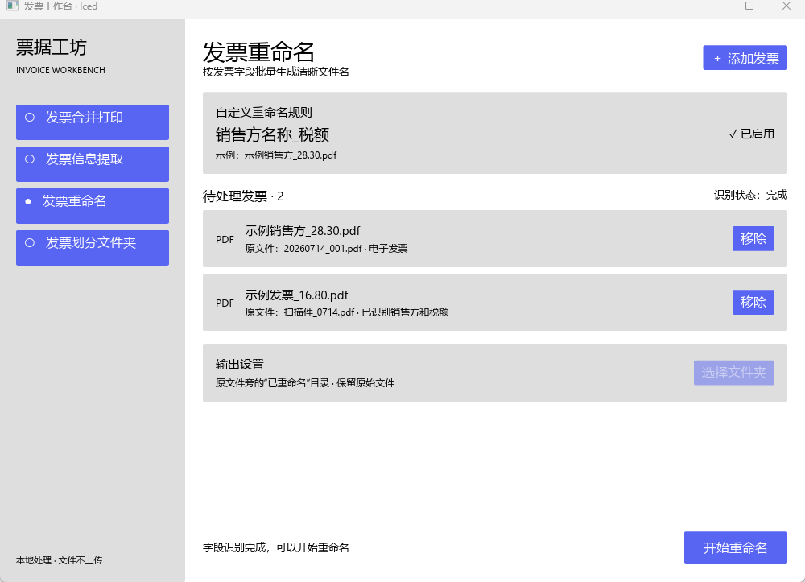

# 发票工作台多框架对比

同一套发票重命名界面分别使用 ZSUI、eframe/egui、Iced、Slint 和 Tauri 2 实现。
所有截图来自 Windows release 构建的真实窗口。

## 界面对比

<table>
  <tr><th>ZSUI</th><th>eframe / egui</th><th>Iced</th></tr>
  <tr>
    <td></td>
    <td></td>
    <td></td>
  </tr>
</table>

<table>
  <tr><th>Slint</th><th>Tauri 2</th></tr>
  <tr>
    <td></td>
    <td></td>
  </tr>
</table>

## 测量结果

测量环境为 Windows NT 10.0.26200.0、16 个逻辑处理器和 Rust 1.94.0。
启动时间取 5 次启动中位数；内存在 3 秒预热后采样 6 次，并包含递归子进程。

| 框架 | 原型开发时间 | 启动到窗口 | 应用代码 | Cargo 包 | 进程 | 二进制 | 私有工作集 | 工作集 |
| --- | ---: | ---: | ---: | ---: | ---: | ---: | ---: | ---: |
| ZSUI | 84.30 s | 69 ms | 93 行 | 94 | 1 | 0.57 MiB | 1.56 MiB | 12.24 MiB |
| eframe/egui | 128.57 s | 66 ms | 274 行 | 295 | 1 | 5.54 MiB | 69.06 MiB | 98.62 MiB |
| Iced | 113.93 s | 70 ms | 213 行 | 347 | 1 | 3.97 MiB | 6.38 MiB | 20.98 MiB |
| Slint | 167.34 s | 68 ms | 207 行 | 579 | 1 | 7.64 MiB | 5.54 MiB | 23.66 MiB |
| Tauri 2 | 175.50 s | 62 ms | 149 行 | 427 | 7 | 2.65 MiB* | 84.07 MiB | 359.92 MiB |

原型开发时间从首次编辑开始，到首次 debug 编译成功为止，包含冷依赖编译和修正。
应用代码只统计应用自有源文件中的非空行，不包含共享框架和生成代码。Tauri 2 的
二进制大小不包含系统安装的 WebView2 运行时，运行内存包含其 WebView2 子进程。
五种实现均未启动 `conhost.exe`。

## 复现

```powershell
.\scripts\measure-invoice-ui-comparison.ps1 -SampleCount 6 -StartupRuns 5 -WarmupSeconds 3
```

脚本使用 release 构建，将构建与测量输出保存在 Git 工作区外的
`zsui-ui-benchmark-support` 目录。
